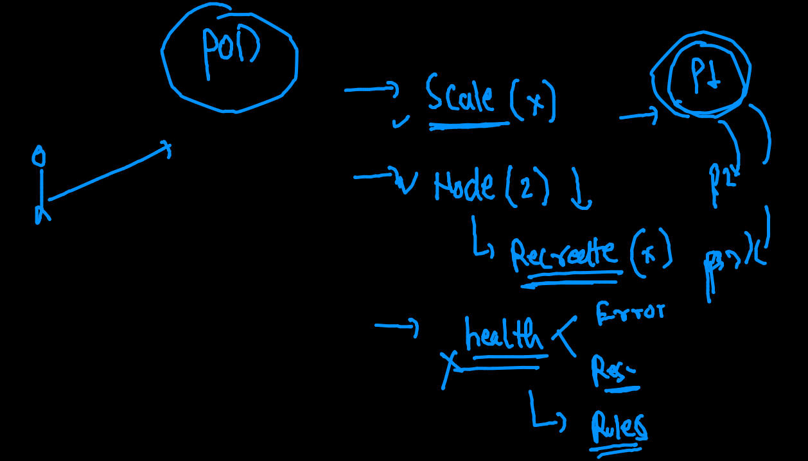
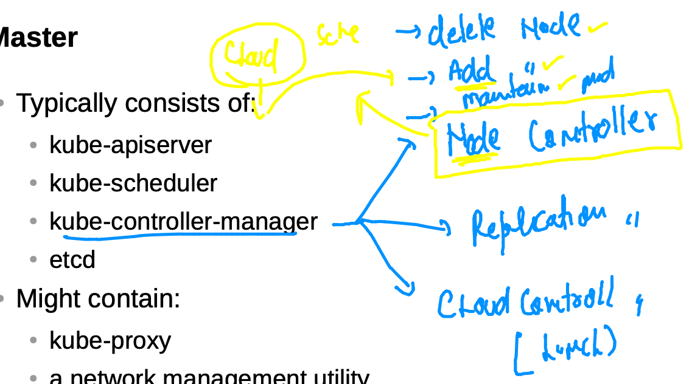
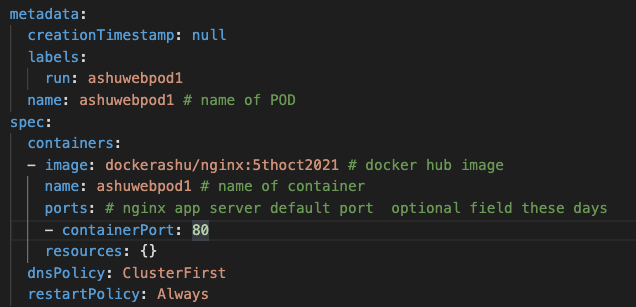
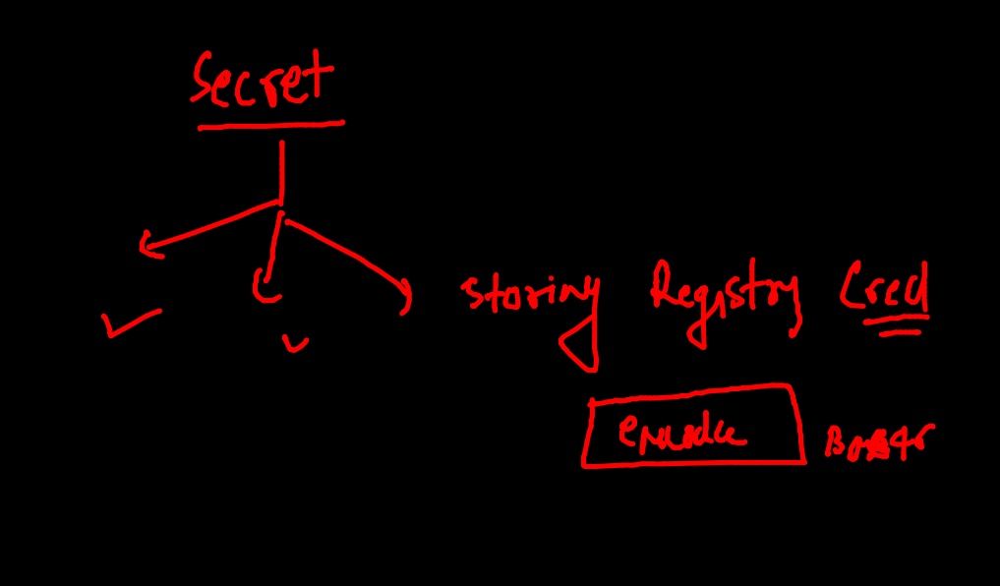

# Plan 


## Certifications 


### kubeadm master node setup and share kubeconfig file steps 

```
1  setenforce  0
    2  sed -i 's/SELINUX=enforcing/SELINUX=disabled/'  /etc/selinux/config
    3  modprobe br_netfilter
    4  echo '1' > /proc/sys/net/bridge/bridge-nf-call-iptables
    5  swapoff  -a
    6  yum  install  docker kubeadm  -y
    7  yum  install kubeadm 
    8  cat  <<EOF  >/etc/yum.repos.d/kube.repo
    9  [kube]
   10  baseurl=https://packages.cloud.google.com/yum/repos/kubernetes-el7-x86_64
   11  gpgcheck=0
   12  EOF
   13  yum  install kubeadm -y
   14  cat  <<X  >/etc/docker/daemon.json
   15  {
   16    "exec-opts": ["native.cgroupdriver=systemd"]
   17  }
   18  X
   19  systemctl enable --now  docker kubelet
   20  history 
   21  hostnamectl set-hostname  masternode
   22  kubeadm  init  --pod-network-cidr=192.168.0.0/16   --apiserver-advertise-address=0.0.0.0   --apiserver-cert-extra-sans=34.192.180.181
   23  mkdir -p $HOME/.kube
   24  ls  /etc/kubernetes/
   25  sudo cp -i /etc/kubernetes/admin.conf $HOME/.kube/config
   26  kubectl  get  nodes
   27  wget https://docs.projectcalico.org/manifests/calico.yaml
   28  ls
   29  kubectl apply -f  calico.yaml 
   30  kubectl  get  nodes
   31  kubectl  get  nodes  -w
   32  kubectl  get  nodes  
   33  cd  /etc/kubernetes/
   34  ls
   35  yum install httpd -y
   36  ls
   37  cp  admin.conf  /var/www/html/
   38  chmod 644  /var/www/html/admin.conf 
   39  systemctl start  httpd
   40  vim /var/www/html/admin.conf 
   
   ```
   
   
### checking number of cluster that client machine can connect 

### listing and switching 

```
fire@ashutoshhs-MacBook-Air  ~  kubectl   config  get-contexts 
CURRENT   NAME                          CLUSTER      AUTHINFO           NAMESPACE
*         kubernetes-admin@kubernetes   kubernetes   kubernetes-admin   
 fire@ashutoshhs-MacBook-Air  ~  
 fire@ashutoshhs-MacBook-Air  ~  
 fire@ashutoshhs-MacBook-Air  ~                     
 fire@ashutoshhs-MacBook-Air  ~  
 fire@ashutoshhs-MacBook-Air  ~  kubectl  config  use-context  kubernetes-admin@kubernetes
Switched to context "kubernetes-admin@kubernetes".
 fire@ashutoshhs-MacBook-Air  ~  
 fire@ashutoshhs-MacBook-Air  ~  
 fire@ashutoshhs-MacBook-Air  ~  kubectl   config  get-contexts                           
CURRENT   NAME                          CLUSTER      AUTHINFO           NAMESPACE
*         kubernetes-admin@kubernetes   kubernetes   kubernetes-admin   
 fire@ashutoshhs-MacBook-Air  ~  
 fire@ashutoshhs-MacBook-Air  ~  kubectl  get  nodes                                      
NAME            STATUS   ROLES                  AGE     VERSION
control-plane   Ready    control-plane,master   2d2h    v1.22.2
minion-node1    Ready    <none>                 2d2h    v1.22.2
minion-node2    Ready    <none>                 2d2h    v1.22.2
minion3         Ready    <none>                 3m51s   v1.22.2

```

### K8s revision 


## Intro to namespace in k8s


### list of namespace 

```
fire@ashutoshhs-MacBook-Air  ~/Desktop/k8s_appdeploy  kubectl   get  namespaces 
NAME              STATUS   AGE
default           Active   2d3h
kube-node-lease   Active   2d3h
kube-public       Active   2d3h
kube-system       Active   2d3h
 fire@ashutoshhs-MacBook-Air  ~/Desktop/k8s_appdeploy  kubectl  get  pods
No resources found in default namespace.

```

### k8s internal components are running here

```
fire@ashutoshhs-MacBook-Air  ~/Desktop/k8s_appdeploy  kubectl get  po  -n  kube-system 
NAME                                       READY   STATUS    RESTARTS      AGE
calico-kube-controllers-75f8f6cc59-8rp9w   1/1     Running   3 (17h ago)   2d3h
calico-node-5qbfh                          1/1     Running   3 (17h ago)   2d3h
calico-node-7sgrt                          1/1     Running   0             22m
calico-node-d7pfx                          1/1     Running   3 (17h ago)   2d3h
calico-node-g7vcl                          1/1     Running   3 (17h ago)   2d3h
coredns-78fcd69978-nvzkn                   1/1     Running   3 (17h ago)   2d3h
coredns-78fcd69978-tw2bp                   1/1     Running   3 (17h ago)   2d3h
etcd-control-plane                         1/1     Running   3 (17h ago)   2d3h
kube-apiserver-control-plane               1/1     Running   3 (17h ago)   2d3h
kube-controller-manager-control-plane      1/1     Running   3 (17h ago)   2d3h
kube-proxy-5csrx                           1/1     Running   3 (17h ago)   2d3h
kube-proxy-6b7ff                         

```

### creating namespaces 

```
fire@ashutoshhs-MacBook-Air  ~/Desktop/k8s_appdeploy  kubectl  create  namespace  ashu-devenv 
namespace/ashu-devenv created
 fire@ashutoshhs-MacBook-Air  ~/Desktop/k8s_appdeploy  
 fire@ashutoshhs-MacBook-Air  ~/Desktop/k8s_appdeploy  kubectl  get  ns                        
NAME              STATUS   AGE
ashu-devenv       Active   4s

```

### changing default namespace 

```
 fire@ashutoshhs-MacBook-Air  ~/Desktop/k8s_appdeploy  kubectl  get   pods
No resources found in default namespace.
 fire@ashutoshhs-MacBook-Air  ~/Desktop/k8s_appdeploy  kubectl  config set-context --current --namespace=ashu-devenv 
Context "kubernetes-admin@kubernetes" modified.
 fire@ashutoshhs-MacBook-Air  ~/Desktop/k8s_appdeploy  
 fire@ashutoshhs-MacBook-Air  ~/Desktop/k8s_appdeploy  
 fire@ashutoshhs-MacBook-Air  ~/Desktop/k8s_appdeploy  kubectl  get   podsNo resources found in ashu-devenv namespace.
 
```

### checking default namespace 

```
kubectl config get-contexts 
CURRENT   NAME                          CLUSTER      AUTHINFO           NAMESPACE
*         kubernetes-admin@kubernetes   kubernetes   kubernetes-admin   ashu-devenv

```


### Deploy app in personal namespace 

```
fire@ashutoshhs-MacBook-Air  ~/Desktop/k8s_appdeploy  kubectl  apply -f  ashunginx.yaml 
pod/ashuwebpod1 created
 fire@ashutoshhs-MacBook-Air  ~/Desktop/k8s_appdeploy  kubectl  get  pods
NAME          READY   STATUS    RESTARTS   AGE
ashuwebpod1   1/1     Running   0          7s
 fire@ashutoshhs-MacBook-Air  ~/Desktop/k8s_appdeploy  kubectl  get  pods -o wide
NAME          READY   STATUS    RESTARTS   AGE   IP               NODE           NOMINATED NODE   READINESS GATES
ashuwebpod1   1/1     Running   0          26s   192.168.100.16   minion-node2   <none>           <none>
 fire@ashutoshhs-MacBook-Air  ~/Desktop/k8s_appdeploy  kubectl  get  po
NAME          READY   STATUS    RESTARTS   AGE
ashuwebpod1   1/1     Running   0          70s
 fire@ashutoshhs-MacBook-Air  ~/Desktop/k8s_appdeploy  kubectl  get  po
NAME          READY   STATUS    RESTARTS   AGE
ashuwebpod1   1/1     Running   0          91s
 fire@ashutoshhs-MacBook-Air  ~/Desktop/k8s_appdeploy  kubectl  expose  pod  ashuwebpod1  --type NodePort  --port 80 --name ashusvc1  
service/ashusvc1 exposed
 fire@ashutoshhs-MacBook-Air  ~/Desktop/k8s_appdeploy  kubectl  get  svc
NAME       TYPE       CLUSTER-IP       EXTERNAL-IP   PORT(S)        AGE
ashusvc1   NodePort   10.105.206.164   <none>        80:30412/TCP   6s

```

### Pod problems 



### Node controller 



### creating rC using POd template 




### deploying RC 

```
fire@ashutoshhs-MacBook-Air  ~/Desktop/k8s_appdeploy  kubectl  apply -f  ashuapp-rc.yaml 
replicationcontroller/ashurc-1 created
 fire@ashutoshhs-MacBook-Air  ~/Desktop/k8s_appdeploy  
 fire@ashutoshhs-MacBook-Air  ~/Desktop/k8s_appdeploy  kubectl  get  rc 
NAME       DESIRED   CURRENT   READY   AGE
ashurc-1   1         1         1       6s
 fire@ashutoshhs-MacBook-Air  ~/Desktop/k8s_appdeploy  kubectl get  po 
NAME             READY   STATUS    RESTARTS   AGE
ashurc-1-54tjl   1/1     Running   0          12s

```

### creating service with expose of RC 

```
kubectl  expose rc  ashurc-1  --type NodePort --port 80 --name ashusv2 
 fire@ashutoshhs-MacBook-Air  ~/Desktop/k8s_appdeploy  kubectl  get  svc
NAME      TYPE       CLUSTER-IP      EXTERNAL-IP   PORT(S)        AGE
ashusv2   NodePort   10.102.115.71   <none>        80:30762/TCP   9s

```

### scaling pod with yaml changes

```
fire@ashutoshhs-MacBook-Air  ~/Desktop/k8s_appdeploy  kubectl  apply -f  ashuapp-rc.yaml 
replicationcontroller/ashurc-1 configured
 fire@ashutoshhs-MacBook-Air  ~/Desktop/k8s_appdeploy  kubectl  get  rcNAME       DESIRED   CURRENT   READY   AGE
ashurc-1   2         2         2       5m57s
 fire@ashutoshhs-MacBook-Air  ~/Desktop/k8s_appdeploy  
 fire@ashutoshhs-MacBook-Air  ~/Desktop/k8s_appdeploy  
 fire@ashutoshhs-MacBook-Air  ~/Desktop/k8s_appdeploy  kubectl  get  po
NAME             READY   STATUS    RESTARTS   AGE
ashurc-1-5cwfx   1/1     Running   0          19s
ashurc-1-ksqsj   1/1     Running   0          4m49s
 fire@ashutoshhs-MacBook-Air  ~/Desktop/k8s_appdeploy  kubectl  get  po --show-labels
NAME             READY   STATUS    RESTARTS   AGE     LABELS
ashurc-1-5cwfx   1/1     Running   0          25s     x=helloashuapp
ashurc-1-ksqsj   1/1     Running   0          4m55s   x=helloashuapp
 fire@ashutoshhs-MacBook-Air  ~/Desktop/k8s_appdeploy  kubectl  get  po --show-labels -o wide
NAME             READY   STATUS    RESTARTS   AGE    IP               NODE           NOMINATED NODE   READINESS GATES   LABELS
ashurc-1-5cwfx   1/1     Running   0          35s    192.168.3.127    minion-node1   <none>           <none>            x=helloashuapp
ashurc-1-ksqsj   1/1     Running   0          5m5s   192.168.50.199   minion3        <none>           <none>            x=helloashuapp
 fire@ashutoshhs-MacBook-Air  ~/Desktop/k8s_appdeploy  
 fire@ashutoshhs-MacBook-Air  ~/Desktop/k8s_appdeploy  kubectl  get  svc
NAME      TYPE       CLUSTER-IP      EXTERNAL-IP   PORT(S)        AGE
ashusv2   NodePort   10.102.115.71   <none>        80:30762/TCP   4m13s

```

### scaling without YAML 

```
fire@ashutoshhs-MacBook-Air  ~/Desktop/k8s_appdeploy  kubectl  scale  rc  ashurc-1  --replicas=3
replicationcontroller/ashurc-1 scaled
 fire@ashutoshhs-MacBook-Air  ~/Desktop/k8s_appdeploy  
 fire@ashutoshhs-MacBook-Air  ~/Desktop/k8s_appdeploy  kubectl  get  rc
NAME       DESIRED   CURRENT   READY   AGE
ashurc-1   3         3         3       8m29s
 fire@ashutoshhs-MacBook-Air  ~/Desktop/k8s_appdeploy  kubectl  get  po
NAME             READY   STATUS    RESTARTS   AGE
ashurc-1-5cwfx   1/1     Running   0          2m47s
ashurc-1-k5zf7   1/1     Running   0          10s
ashurc-1-ksqsj   1/1     Running   0          7m17s
 fire@ashutoshhs-MacBook-Air  ~/Desktop/k8s_appdeploy  kubectl  get  po -o wide
NAME             READY   STATUS    RESTARTS   AGE     IP               NODE           NOMINATED NODE   READINESS GATES
ashurc-1-5cwfx   1/1     Running   0          2m53s   192.168.3.127    minion-node1   <none>           <none>
ashurc-1-k5zf7   1/1     Running   0          16s     192.168.100.11   minion-node2   <none>           <none>
ashurc-1-ksqsj   1/1     Running   0          7m23s   192.168.50.199   minion3        <none>           <none>

```

### Docker images in Private Registry 

### OCR

```
 docker  tag   0c115a9924ec   phx.ocir.io/axmbtg8judkl/webapp:v1 
   84  docker  images
   85  docker  login  phx.ocir.io  
   86  docker  login  phx.ocir.io  -u  axmbtg8judkl/learntechbyme@gmail.com  
   87  docker  push  phx.ocir.io/axmbtg8judkl/webapp:v1
   88  docker  logout  phx.ocir.io  
```

### Deploy app from OCR 

```
fire@ashutoshhs-MacBook-Air  ~/Desktop/k8s_appdeploy  kubectl apply -f  ocrapp.yaml 
replicationcontroller/ashurc-1 created
 fire@ashutoshhs-MacBook-Air  ~/Desktop/k8s_appdeploy  kubectl  get rc
NAME       DESIRED   CURRENT   READY   AGE
ashurc-1   1         1         0       7s
 fire@ashutoshhs-MacBook-Air  ~/Desktop/k8s_appdeploy  kubectl  get po
NAME             READY   STATUS         RESTARTS   AGE
ashurc-1-4q8kb   0/1     ErrImagePull   0          15s

```

###  intro to secret 



### creating secret 

```
kubectl  create  secret  
Create a secret using specified subcommand.

Available Commands:
  docker-registry Create a secret for use with a Docker registry
  generic         Create a secret from a local file, directory or literal value
  tls             Create a TLS secret


kubectl  create  secret   docker-registry  ashusec1  --docker-server=phx.ocir.io  --docker-username  judkl/lchme@gmail.com  --docker-password='9.1Od_IAL'  
secret/ashusec1 created
 fire@ashutoshhs-MacBook-Air  ~/Desktop/k8s_appdeploy  
 fire@ashutoshhs-MacBook-Air  ~/Desktop/k8s_appdeploy  
 fire@ashutoshhs-MacBook-Air  ~/Desktop/k8s_appdeploy  kubectl  get  secret  
NAME                  TYPE                                  DATA   AGE
ashusec1              kubernetes.io/dockerconfigjson        1      7s
default-token-9j5cc   kubernetes.io/service-account-token   3      112m

```


