# Plan 

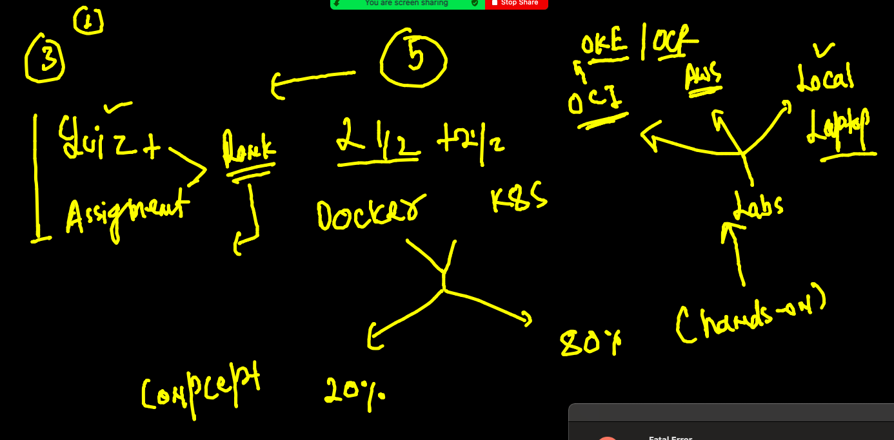

## day1 revision 

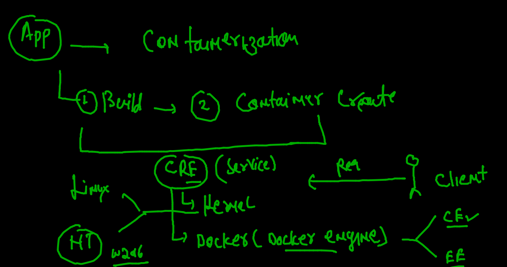

##  Docker client to docker engine connection cases

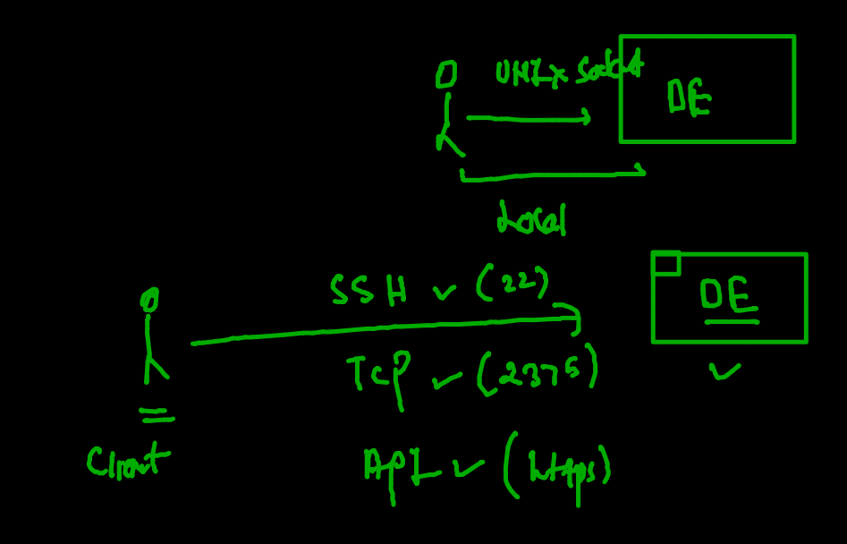

### building java code into docker image

```
ashu@ip-172-31-18-96 myimages]$ cd  javacode/
[ashu@ip-172-31-18-96 javacode]$ ls
Dockerfile  oracle.java
[ashu@ip-172-31-18-96 javacode]$ docker  build  -t   ashujava:codev1  .  
Sending build context to Docker daemon  3.072kB
Step 1/7 : FROM openjdk
 ---> 98edbd09d5e6
Step 2/7 : label email=ashutoshh@linux.com
 ---> Running in 10e2922a16ff
Removing intermediate container 10e2922a16ff
 ---> 4dd491a4c7d1
Step 3/7 : RUN mkdir  /myapp
 ---> Running in 2c8b4d76c3ee
Removing intermediate container 2c8b4d76c3ee
 ---> 7a126d0ef74a
Step 4/7 : COPY oracle.java /myapp/oracle.java
 ---> 7ba91b6ef440
Step 5/7 : WORKDIR  /myapp
 ---> Running in 1f3139ca1e07
Removing intermediate container 1f3139ca1e07
 ---> f412884e2e6b
Step 6/7 : RUN  javac  oracle.java
 ---> Running in e6ec53998d66
Removing intermediate container e6ec53998d66
 ---> b9f6c126eb04
Step 7/7 : CMD ["java","myclass"]
 ---> Running in 814cc784fe20
Removing intermediate container 814cc784fe20
 ---> 353576edaf4e
Successfully built 353576edaf4e
Successfully tagged ashujava:codev1

```

### creating container 

```
[ashu@ip-172-31-18-96 javacode]$ docker  run -it -d  --name ashujc1  ashujava:codev1 
5b938631ff6046461ecebf54bfaf9d7b835f723f900435722a7292134860fd5c
[ashu@ip-172-31-18-96 javacode]$ docker  ps
CONTAINER ID   IMAGE              COMMAND          CREATED              STATUS              PORTS     NAMES
5b938631ff60   ashujava:codev1    "java myclass"   12 seconds ago       Up 8 seconds                  ashujc1

```

### checking container logs

```
docker logs -f ashujc1

```

### clearning up 

```
[ashu@ip-172-31-18-96 javacode]$ docker  stop  ashujc1
ashujc1
[ashu@ip-172-31-18-96 javacode]$ docker  rm  ashujc1
ashujc1

```

### installing jdk 8 in OL 8.3 

### searching software name 

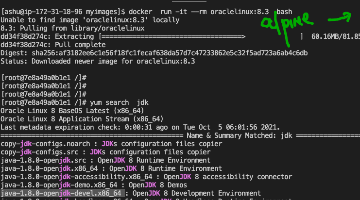

### build is done 

```
[ashu@ip-172-31-18-96 javacode]$ ls
Dockerfile  jdk8.dockerfile  oracle.java
[ashu@ip-172-31-18-96 javacode]$ docker  build -t  ashujava:jdk8  -f  jdk8.dockerfile   . 
Sending build context to Docker daemon  4.608kB
Step 1/8 : from oraclelinux:8.3
 ---> 816d99f0bbe8
Step 2/8 : LABEL email="ashutoshh@linux.com"
 ---> Using cache
 ---> 03c902b73188
Step 3/8 : RUN  yum install java-1.8.0-openjdk.x86_64 java-1.8.0-openjdk-devel.x86_64  -y
 ---> Using cache
 ---> 69ee4bd954be
Step 4/8 : RUN mkdir /hello
 ---> Running in e8ed83d979ff
Removing intermediate container e8ed83d979ff
 ---> a4991db1e629
Step 5/8 : ADD oracle.java /hello/
 ---> a10947082131
Step 6/8 : WORKDIR /hello
 ---> Running in 7b413cdbc07a
Removing intermediate container 7b413cdbc07a
 ---> 5f6501753fc8
Step 7/8 : RUN javac oracle.java
 ---> Running in df528e0531b8
Removing intermediate container df528e0531b8
 ---> 7a5029ac8175
Step 8/8 : ENTRYPOINT java myclass
 ---> Running in 2334ff637ac6
Removing intermediate container 2334ff637ac6
 ---> c81540c31174
Successfully built c81540c31174
Successfully tagged ashujava:jdk8

```

### Pushing and pulling docker hub images 


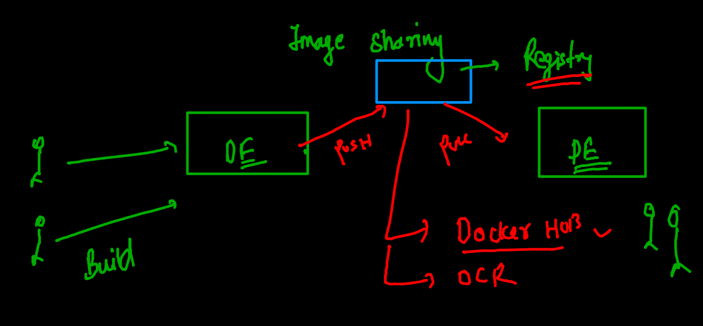

### image name 

 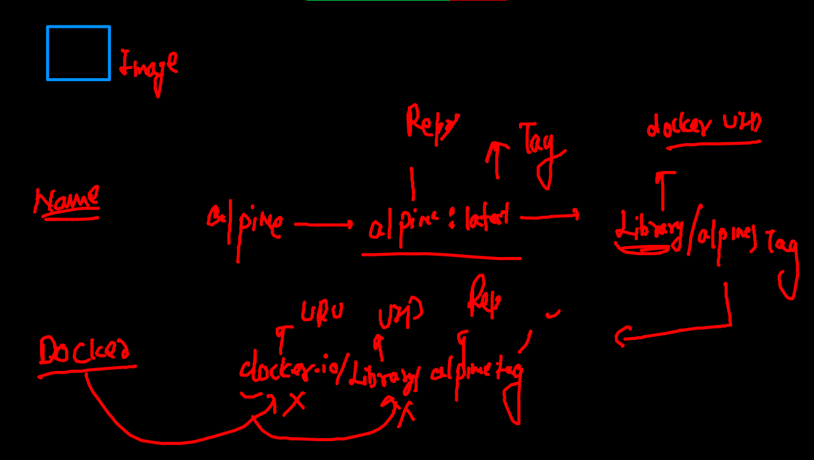
 
 ### pushing 
 
 
 ```
 [ashu@ip-172-31-18-96 javacode]$ docker  tag  fa00173e64d3    dockerashu/pythonrepo:v1  
[ashu@ip-172-31-18-96 javacode]$ docker  login -u dockerashu
Password: 
WARNING! Your password will be stored unencrypted in /home/ashu/.docker/config.json.
Configure a credential helper to remove this warning. See
https://docs.docker.com/engine/reference/commandline/login/#credentials-store

Login Succeeded
[ashu@ip-172-31-18-96 javacode]$ docker  push  dockerashu/pythonrepo:v1  
The push refers to repository [docker.io/dockerashu/pythonrepo]
e2d29b2f9119: Pushed 
3de768a537a0: Pushed 
fef24ee00d9b: Pushed 
4b4f328f6bb4: Mounted from library/oraclelinux 

 ```
      
### restart policy here

```
Flag	Description
no	Do not automatically restart the container. (the default)
on-failure	Restart the container if it exits due to an error, which manifests as a non-zero exit code.
always	Always restart the container if it stops. If it is manually stopped, it is restarted only when Docker daemon restarts or the container itself is manually restarted. (See the second bullet listed in restart policy details)
unless-stopped	Similar to always, except that when the container is stopped (manually or otherwise), it is not restarted even after Docker daemon restarts.


```

### 

```
docker  run -itd --name ashuc3 --restart  always  --memory 50m --cpu-shares=40 alpine ping fb.com 
a422b5f49ecacfbb7d8a2b87bd99136af1a47d2683fa45e99e9c955df6d83cde
[ashu@ip-172-31-18-96 javacode]$ docker  ps
CONTAINER ID   IMAGE        COMMAND                  CREATED              STATUS              PORTS     NAMES
a422b5f49eca   alpine       "ping fb.com"            10 seconds ago       Up 3 seconds                  ashuc3
c48795cb7968   rajiol8:v1   "/bin/sh -c 'java my…"   12 seconds ago       Up 10 seconds                 rajiol8c1
62dbc8ec0468   alpine       "ping fb.com"            About a minute ago   Up About a minute             rupajava
d7bc030623f5   alpine       "ping fb.com"            3 minutes ago        Up 3 minutes                  ashuc2
69e098a97192   alpine       "/bin/sh"                6 minutes ago        Up 6 minutes                  ashuc1
[ashu@ip-172-31-18-96 javacode]$ 

```


### Cgroup and restart policy update

```
183  docker run  -itd  --name  ashutoshhcg1 --cpu-shares=30  busybox ping localhost 
  184  docker  ps
  185  history 
  186  docker update  ashutoshhcg1  --memory 300m 
  187  docker update  --help
  188  docker update  ashutoshhcg1  --memory 300m  --memory-swap 300m 
  189  docker  stats
  190  history 
  191  docker  inspect  ashutoshhcg1
  192  history 
  193  docker update  ashutoshhcg1  --restart always
  
```

### webapp containerization 

### app server / web server engines

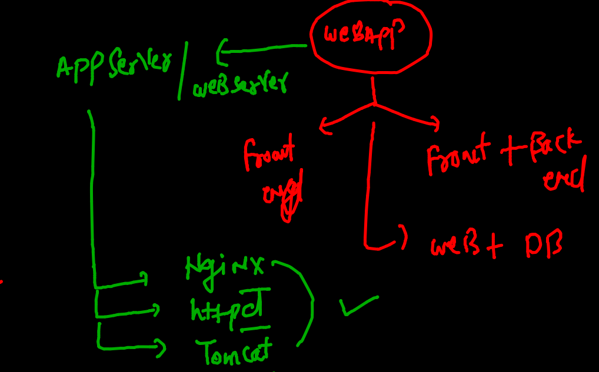

### webapp containerization 

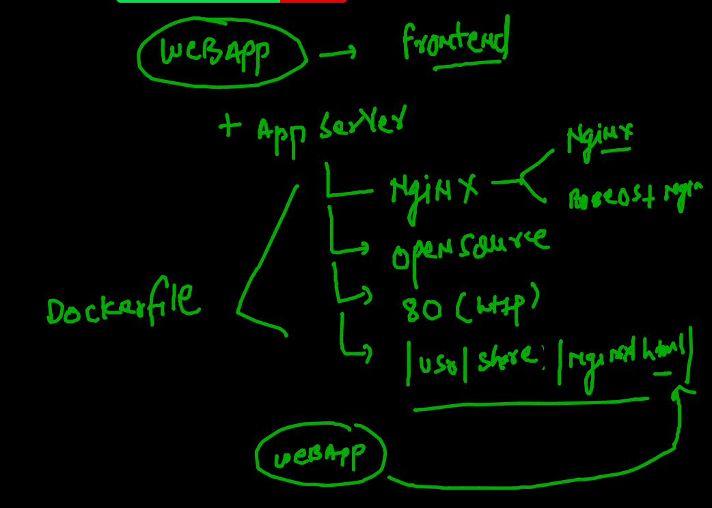

### cleaning up all the containers and images

```
196  docker  rm  $(docker  ps -aq) -f
  197  docker  rmi $(docker  images -q) -f
  
```

###  cloning sample app of html / css /js

```
git clone  https://github.com/schoolofdevops/html-sample-app

```

### building docker images

```
[ashu@ip-172-31-18-96 myimages]$ cd  html-sample-app/
[ashu@ip-172-31-18-96 html-sample-app]$ ls
assets  Dockerfile  elements.html  generic.html  html5up-phantom.zip  images  index.html  LICENSE.txt  README.txt
[ashu@ip-172-31-18-96 html-sample-app]$ docker  build  -t  nginx:ashuapp1  . 
Sending build context to Docker daemon  2.099MB
Step 1/4 : FROM nginx
latest: Pulling from library/nginx
07aded7c29c6: Pull complete 
bbe0b7acc89c: Pull complete 
44ac32b0bba8: Pull complete 
91d6e3e593db: Pull complete 
8700267f2376: Pull complete 
4ce73aa6e9b0: Pull complete 
Digest: sha256:765e51caa9e739220d59c7f7a75508e77361b441dccf128483b7f5cce8306652
Status: Downloaded newer image for nginx:latest
 ---> f8f4ffc8092c
Step 2/4 : LABEL name="ashutoshh"
 ---> Running in dee4d3bedcac
Removing intermediate container dee4d3bedcac
 ---> 2f17671b2948
Step 3/4 : COPY . /usr/share/nginx/html/
 ---> 5d3974a569fa
Step 4/4 : EXPOSE 80
 ---> Running in 07c241bcc1fe
Removing intermediate container 07c241bcc1fe
 ---> 0c115a9924ec
Successfully built 0c115a9924ec
Successfully tagged nginx:ashuapp1

```

### we can check build history 

```
[ashu@ip-172-31-18-96 html-sample-app]$ docker history  nginx:ashuapp1  
IMAGE          CREATED         CREATED BY                                      SIZE      COMMENT
0c115a9924ec   2 minutes ago   /bin/sh -c #(nop)  EXPOSE 80                    0B        
5d3974a569fa   2 minutes ago   /bin/sh -c #(nop) COPY dir:db1abaf7b384b0a81…   2.05MB    
2f17671b2948   2 minutes ago   /bin/sh -c #(nop)  LABEL name=ashutoshh         0B        
f8f4ffc8092c   7 da

```

### pushing imaget to docker hub 

```
214  docker  tag   nginx:ashuapp1   dockerashu/nginx:5thoct2021 
  215  docker login -u dockerashu
  216  docker  push dockerashu/nginx:5thoct2021
  217  docker logout 
  
```

## COntainer networking 

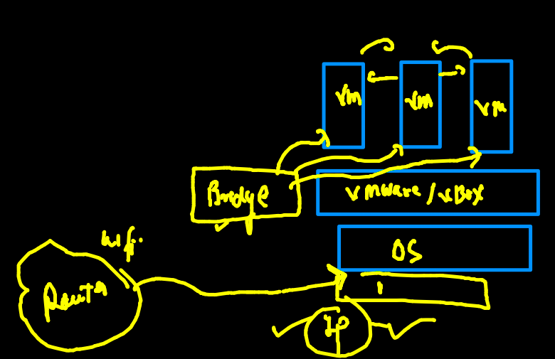

### Container networking model

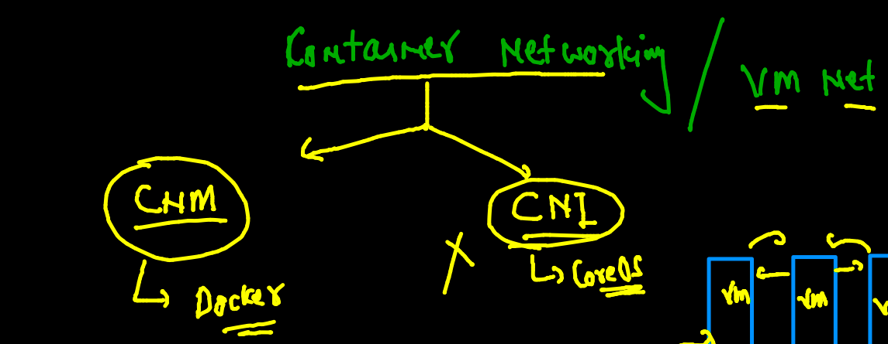

### Docker networking pic 1


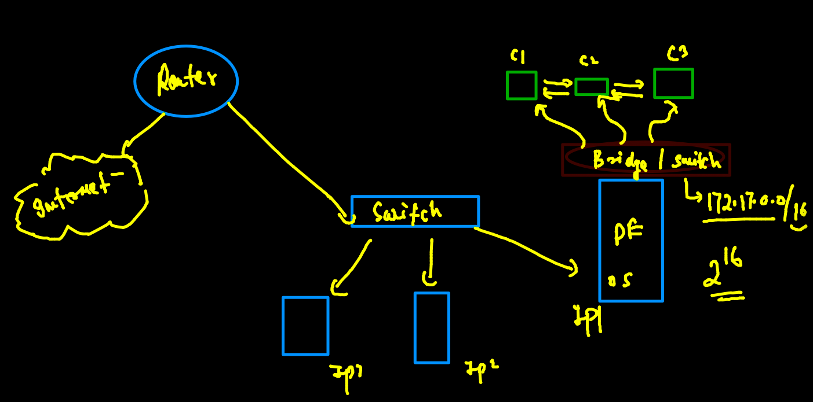

### NAT in docker host 

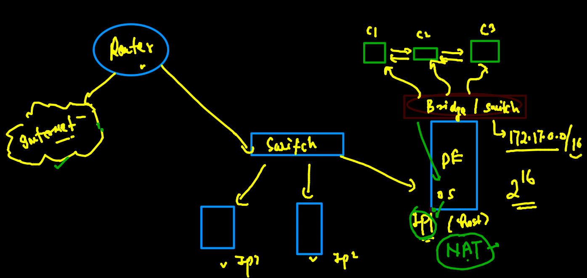

### COntainer networking 

```
[ashu@ip-172-31-18-96 html-sample-app]$ docker  ps
CONTAINER ID   IMAGE     COMMAND   CREATED   STATUS    PORTS     NAMES
[ashu@ip-172-31-18-96 html-sample-app]$ docker run  -it  --name ashuc1  alpine  
Unable to find image 'alpine:latest' locally
latest: Pulling from library/alpine
a0d0a0d46f8b: Pull complete 
Digest: sha256:e1c082e3d3c45cccac829840a25941e679c25d438cc8412c2fa221cf1a824e6a
Status: Downloaded newer image for alpine:latest
/ # 
/ # ifconfig 
eth0      Link encap:Ethernet  HWaddr 02:42:AC:11:00:02  
          inet addr:172.17.0.2  Bcast:172.17.255.255  Mask:255.255.0.0
          UP BROADCAST RUNNING MULTICAST  MTU:1500  Metric:1
          RX packets:8 errors:0 dropped:0 overruns:0 frame:0
          TX packets:0 errors:0 dropped:0 overruns:0 carrier:0
          collisions:0 txqueuelen:0 
          RX bytes:680 (680.0 B)  TX bytes:0 (0.0 B)

lo        Link encap:Local Loopback  
          inet addr:127.0.0.1  Mask:255.0.0.0
          UP LOOPBACK RUNNING  MTU:65536  Metric:1
          RX packets:0 errors:0 dropped:0 overruns:0 frame:0
          TX packets:0 errors:0 dropped:0 overruns:0 carrier:0
          collisions:0 txqueuelen:1000 
          RX bytes:0 (0.0 B)  TX bytes:0 (0.0 B)


```

### Port forwarding and NAT rules

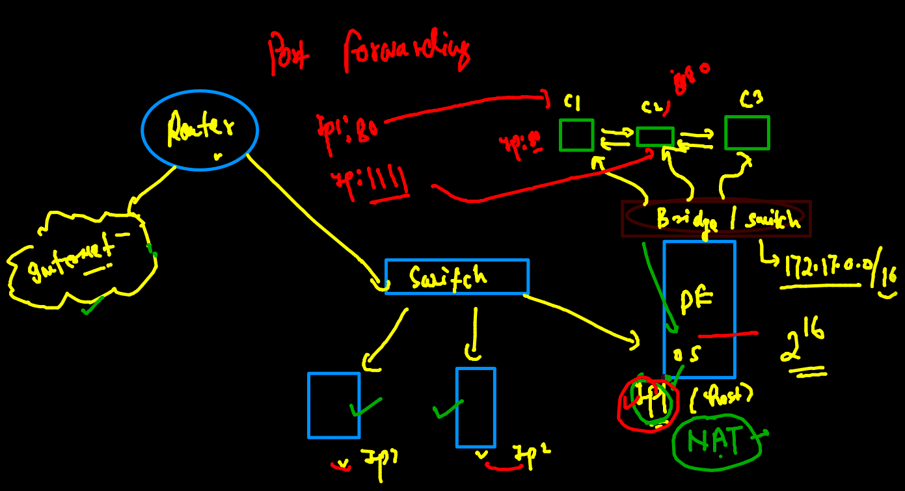

### launching first continer 

```
ashu@ip-172-31-18-96 html-sample-app]$ docker run -itd  --name ashungc1 -p  1234:80  dockerashu/nginx:5thoct2021
14062dd436b946b8532d309035aea9cc887380175b38948fe6714e7b2eaf55fe
[ashu@ip-172-31-18-96 html-sample-app]$ docker  ps
CONTAINER ID   IMAGE                         COMMAND                  CREATED         STATUS         PORTS                                   NAMES
14062dd436b9   dockerashu/nginx:5thoct2021   "/docker-entrypoint.…"   8 seconds ago   Up 7 seconds   0.0.0.0:1234->80/tcp, :::1234->80/tcp   ashungc1

```

### reason for custom bridge creation 

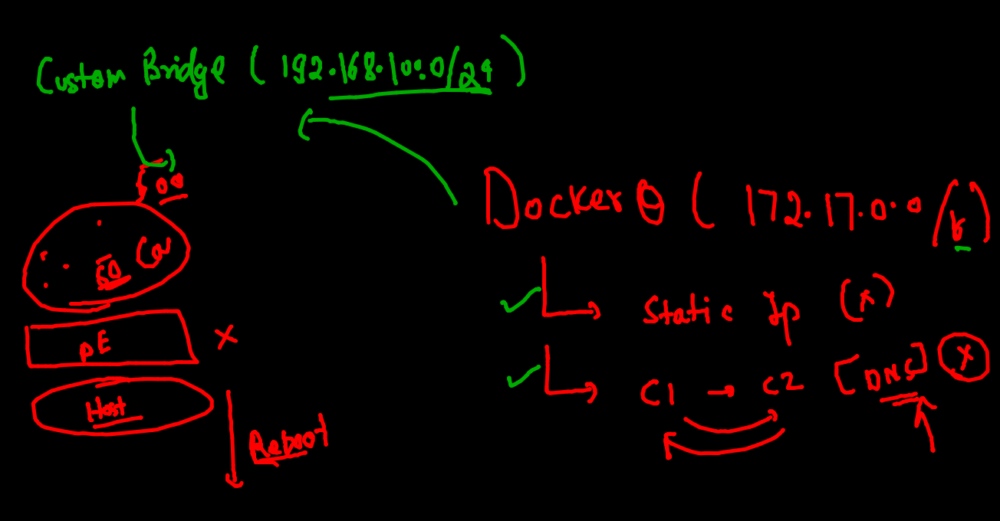

### default bridges in docker engine 

```
[ashu@ip-172-31-18-96 html-sample-app]$ docker  network  ls
NETWORK ID     NAME      DRIVER    SCOPE
441f361b420a   bridge    bridge    local
6b9b473c6930   host      host      local
c6c91397326a   none      null      local
[ashu@ip-172-31-18-96 html-sample-app]$ docker  network  inspect  bridge
[
    {
        "Name": "bridge",
        "Id": "441f361b420ade7795f5d7c8257150a321b53dbdda468482c3906ab282461818",
        "Created": "2021-10-05T03:37:42.953791595Z",
        "Scope": "local",
        "Driver": "bridge",
        "EnableIPv6": false,
        "IPAM": {
            "Driver": "default",
            "Options": null,
            "Config": [
                {
                    "Subnet": "172.17.0.0/16",
                    "Gateway": "172.17.0.1"
                }
            ]
        },
        
        
 ```
 
 
 ### creating docker bridge 
 
 ```
 [ashu@ip-172-31-18-96 html-sample-app]$ docker  network  create  ashubr1
5c837e04947453f70e45fff74d6b9cac5dfc1989d4d38ac8bb4682c0988ac610
[ashu@ip-172-31-18-96 html-sample-app]$ docker  network  ls
NETWORK ID     NAME      DRIVER    SCOPE
5c837e049474   ashubr1   bridge    local
441f361b420a   bridge    bridge    local
6b9b473c6930   host      host      local
c6c91397326a   none      null      local

```

### checking bridge internal details 

```
[ashu@ip-172-31-18-96 html-sample-app]$ docker  network  inspect  ashubr1
[
    {
        "Name": "ashubr1",
        "Id": "5c837e04947453f70e45fff74d6b9cac5dfc1989d4d38ac8bb4682c0988ac610",
        "Created": "2021-10-05T10:15:33.083845594Z",
        "Scope": "local",
        "Driver": "bridge",
        "EnableIPv6": false,
        "IPAM": {
            "Driver": "default",
            "Options": {},
            "Config": [
                {
                    "Subnet": "172.18.0.0/16",
                    "Gateway": "172.18.0.1"
                }
            ]
            
```

### multiple bridge means network level isolation 

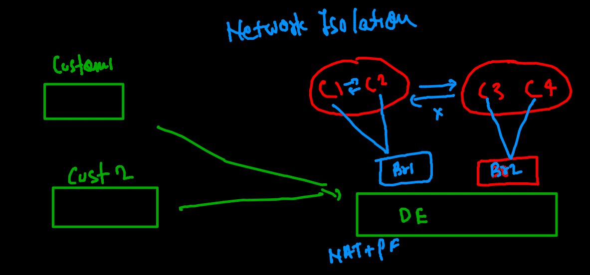

### creating container in custom bridge

```
 docker run -itd  --name ashungc1   --nwork ashubr1 dockerashu/nginx:5thoct2021
  255   docker run -itd  --name ashungc1   --network ashubr1 dockerashu/nginx:5thoct2021
  
```

### docker bridge with custom subnet 

```
docker  network  create  ashubr2  --subnet  192.168.200.0/24 

 269  docker  network  create  ashubr2  --subnet  192.168.200.0/24  
  270  docker run -itd  --name ashuc44   --network ashubr2 oraclelinux:8.4
  271  docker run -itd  --name ashuc55  --network ashubr2 --ip  192.168.200.100  oraclelinux:8.4
  
  [ashu@ip-172-31-18-96 html-sample-app]$ docker  exec -it ashuc44  bash 
[root@1256765f43e7 /]# ping ashuc55
PING ashuc55 (192.168.200.100) 56(84) bytes of data.
64 bytes from ashuc55.ashubr2 (192.168.200.100): icmp_seq=1 ttl=255 time=0.080 ms
64 bytes from ashuc55.ashubr2 (192.168.200.100): icmp_seq=2 ttl=255 time=0.067 ms
64 bytes from ashuc55.ashubr2 (192.168.200.100): icmp_seq=3 ttl=255 time=0.068 ms
64 bytes from ashuc55.ashubr2 (192.168.200.100): icmp_seq=4 ttl=255 time=0.065 ms
64 bytes from ashuc55.ashubr2 (192.168.200.100): icmp_seq=5 ttl=255 time=0.071 ms
^C
--- ashuc55 ping statistics ---
5 packets transmitted, 5 received, 0% packet loss, time 4081ms
rtt min/avg/max/mdev = 0.065/0.070/0.080/0.007 ms
[root@1256765f43e7 /]# exit
exit
  
```


