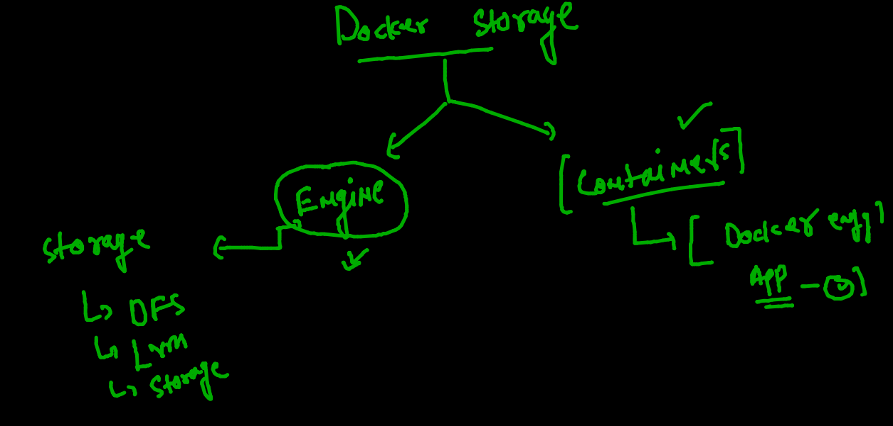
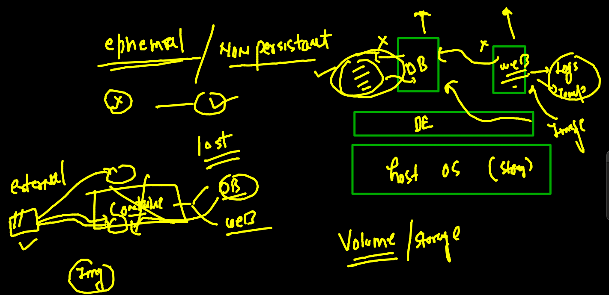
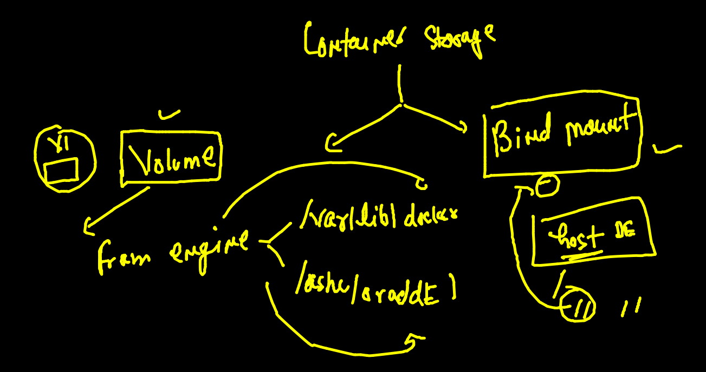
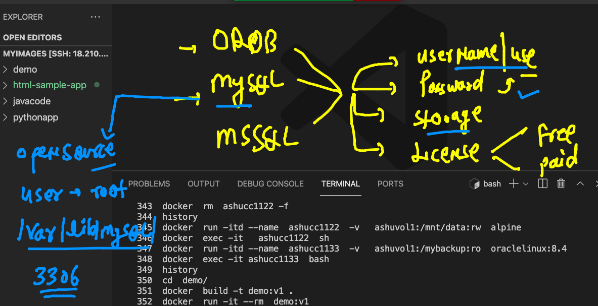

# Plan 


### Docker network prune 

```
[ashu@ip-172-31-18-96 myimages]$ docker  network  prune 
WARNING! This will remove all custom networks not used by at least one container.
Are you sure you want to continue? [y/N] y
Deleted Networks:
ashubrx1
rahulbrx1
chandrabrx2
shinibrx2
chandrabrx1
yagneshbrx1
sidbrx1
shinikrishnabrx2
shinibrx1
mohitbrx1
rajibrx1

```

## Storage concept in Docker 



### COnfigure external storage drive to Docker engine 

### attaching and formatting storage to VM 

```
[root@ip-172-31-18-96 ~]# lsblk 
NAME          MAJ:MIN RM  SIZE RO TYPE MOUNTPOINT
nvme0n1       259:0    0  100G  0 disk 
├─nvme0n1p1   259:1    0  100G  0 part /
└─nvme0n1p128 259:2    0    1M  0 part 
nvme1n1       259:3    0  500G  0 disk 
[root@ip-172-31-18-96 ~]# 
[root@ip-172-31-18-96 ~]# 
[root@ip-172-31-18-96 ~]# mkfs.xfs   /dev/nvme1n1  
meta-data=/dev/nvme1n1           isize=512    agcount=4, agsize=32768000 blks
         =                       sectsz=512   attr=2, projid32bit=1
         =                       crc=1        finobt=1, sparse=0
data     =                       bsize=4096   blocks=131072000, imaxpct=25
         =                       sunit=0      swidth=0 blks
naming   =version 2              bsize=4096   ascii-ci=0 ftype=1
log      =internal log           bsize=4096   blocks=64000, version=2
         =                       sectsz=512   sunit=0 blks, lazy-count=1
realtime =none                   extsz=4096   blocks=0, rtextents=0

```

### attaching storage to a directory 

```
 mkdir   /ashu/oracleDE -p 
[root@ip-172-31-18-96 ~]# 
[root@ip-172-31-18-96 ~]# mount  /dev/nvme1n1  /ashu/oracleDE/

```

### configuring Docker engine to use storage 

```
[root@ip-172-31-18-96 sysconfig]# ls
acpid       cpupower        irqbalance  network-scripts  rpc-rquotad  sysstat
atd         crond           keyboard    nfs              rsyncd       sysstat.ioconf
authconfig  docker          man-db      raid-check       rsyslog
chronyd     docker-storage  modules     rdisc            run-parts
clock       i18n            netconsole  readonly-root    selinux
console     init            network     rpcbind          sshd
[root@ip-172-31-18-96 sysconfig]# cat  docker
# The max number of open files for the daemon itself, and all
# running containers.  The default value of 1048576 mirrors the value
# used by the systemd service unit.
DAEMON_MAXFILES=1048576

# Additional startup options for the Docker daemon, for example:
# OPTIONS="--ip-forward=true --iptables=true"
# By default we limit the number of open files per container
OPTIONS="--default-ulimit nofile=32768:65536 -g  /ashu/oracleDE "

```

### restarting docker engine 

```
 systemctl daemon-reload 
[root@ip-172-31-18-96 sysconfig]# systemctl restart docker

```
### Sync data from Old location to new 

```
 58  rsync -av  /var/lib/docker/  /ashu/oracleDE/
   59  systemctl restart docker 
   
```

### make sure you entry in /etc/fstab about new storage mount 


### COntainers are ephemral in nature 



### checking ephemral nature 

```
[ashu@ip-172-31-18-96 ~]$ docker  run -it  --name ashucc1  alpine  sh 
/ # ls
bin    dev    etc    home   lib    media  mnt    opt    proc   root   run    sbin   srv    sys    tmp    usr    var
/ # mkdir hiii oracle
/ # ls
bin     etc     home    media   opt     proc    run     srv     tmp     var
dev     hiii    lib     mnt     oracle  root    sbin    sys     usr
/ # exit
[ashu@ip-172-31-18-96 ~]$ docker  rm  ashucc1 
ashucc1
[ashu@ip-172-31-18-96 ~]$ 
[ashu@ip-172-31-18-96 ~]$ docker  run -it  --name ashucc1  alpine  sh 
/ # ls
bin    dev    etc    home   lib    media  mnt    opt    proc   root   run    sbin   srv    sys    tmp    usr    var
/ # exit
[ashu@ip-172-31-18-96 ~]$ docker  rm  ashucc1 
ashucc1

```

### COntainer storage 




### creating volume 

```
[ashu@ip-172-31-18-96 ~]$ docker  volume  ls
DRIVER    VOLUME NAME
[ashu@ip-172-31-18-96 ~]$ docker  volume   create  ashuvol1
ashuvol1
[ashu@ip-172-31-18-96 ~]$ docker  volume  ls
DRIVER    VOLUME NAME
local     ashuvol1
[ashu@ip-172-31-18-96 ~]$ docker  volume  inspect  ashuvol1
[
    {
        "CreatedAt": "2021-10-06T05:52:12Z",
        "Driver": "local",
        "Labels": {},
        "Mountpoint": "/ashu/oracleDE/volumes/ashuvol1/_data",
        "Name": "ashuvol1",
        "Options": {},
        "Scope": "local"
    }
]

```

## creating container with volume attached

```
docker  run -itd --name  ashucc1122  -v   ashuvol1:/mnt/data:rw  alpine  
3ebe0d237c2d18410298c5e10b2070a45fe9b6d1dde34cbd9166c04ba06eb354
[ashu@ip-172-31-18-96 ~]$ 
[ashu@ip-172-31-18-96 ~]$ 
[ashu@ip-172-31-18-96 ~]$ docker  ps
CONTAINER ID   IMAGE     COMMAND     CREATED          STATUS          PORTS     NAMES
54180fb3b220   alpine    "/bin/sh"   6 seconds ago    Up 5 seconds              rupa
e7214ddb1cb8   alpine    "/bin/sh"   49 seconds ago   Up 48 seconds             pric1
3ebe0d237c2d   alpine    "/bin/sh"   52 seconds ago   Up 51 seconds             ashucc1122

```

### storing data in a volume 

```
[ashu@ip-172-31-18-96 ~]$ docker  exec -it   ashucc1122  sh
/ # 
/ # cd  /mnt/data/
/mnt/data # ls
/mnt/data # mkdir  hello world
/mnt/data # touch aa{1..10}.txt
/mnt/data # ls
aa{1..10}.txt  hello          world
/mnt/data # exit

```

### checking volume data

```
docker  rm  ashucc1122 -f

```

```

[ashu@ip-172-31-18-96 ~]$ docker  run -itd --name  ashucc1122  -v   ashuvol1:/mnt/data:rw  alpine
e47eceefca566e806de194db825d8b2cab734213279e8e8c28e13c2e57d6b4ef
[ashu@ip-172-31-18-96 ~]$ 
[ashu@ip-172-31-18-96 ~]$ docker  exec -it   ashucc1122  sh
/ # 
/ # cd  /mnt/data/
/mnt/data # ls
aa{1..10}.txt  hello          world
/mnt/data # mkdir hii 
/mnt/data # ls
aa{1..10}.txt  hello          hii            world
/mnt/data # exit

```

### mounting volume with readonly option 

```
[ashu@ip-172-31-18-96 ~]$ docker  run -itd --name  ashucc1133  -v   ashuvol1:/mybackup:ro  oraclelinux:8.4
1dfe4f27f7cea1de0569bfa73c41180b8f54a34f63e859f852625ef0c1b436df
[ashu@ip-172-31-18-96 ~]$ docker  exec -it ashucc1133  bash 
[root@1dfe4f27f7ce /]# 
[root@1dfe4f27f7ce /]# cd /mybackup/
[root@1dfe4f27f7ce mybackup]# ls
aa{1..10}.txt  hello  hii  world
[root@1dfe4f27f7ce mybackup]# rmdir hii
rmdir: failed to remove 'hii': Read-only file system
[root@1dfe4f27f7ce mybackup]# mkdir  okk
mkdir: cannot create directory 'okk': Read-only file system
[root@1dfe4f27f7ce mybackup]# exit
exit

```

### cleaning up 

```
354  docker rm $(docker  ps -aq) -f
  355  docker  volume rm $(docker volume ls -q)
  
```

### DB as COntainer 



### creating DB mysql container 

```
docker  run -itd --name ashudb -v  ashudbvol1:/var/lib/mysql/  -e MYSQL_ROOT_PASSWORD=oracleDB077   mysql  

```

### login to DB container 

```
[ashu@ip-172-31-18-96 myimages]$ docker  exec -i  ashudb   bash 
root@5983d49fa823:/# 
root@5983d49fa823:/# 
root@5983d49fa823:/# cat  /etc/os-release 
PRETTY_NAME="Debian GNU/Linux 10 (buster)"
NAME="Debian GNU/Linux"
VERSION_ID="10"
VERSION="10 (buster)"
VERSION_CODENAME=buster
ID=debian
HOME_URL="https://www.debian.org/"
SUPPORT_URL="https://www.debian.org/support"
BUG_REPORT_URL="https://bugs.debian.org/"


root@5983d49fa823:/# mysql -u root  -p 
Enter password: 
Welcome to the MySQL monitor.  Commands end with ; or \g.
Your MySQL connection id is 8
Server version: 8.0.26 MySQL Community Server - GPL

Copyright (c) 2000, 2021, Oracle and/or its affiliates.

Oracle is a registered trademark of Oracle Corporation and/or its
affiliates. Other names may be trademarks of their respective
owners.

Type 'help;' or '\h' for help. Type '\c' to clear the current input statement.

mysql> 


```

### hitting query and creating database 

```
mysql> show  databases;
+--------------------+
| Database           |
+--------------------+
| information_schema |
| mysql              |
| performance_schema |
| sys                |
+--------------------+
4 rows in set (0.01 sec)

mysql> create  database  oracle_team;
Query OK, 1 row affected (0.00 sec)

mysql> show  databases;
+--------------------+
| Database           |
+--------------------+
| information_schema |
| mysql              |
| oracle_team        |
| performance_schema |
| sys                |
+--------------------+
5 rows in set (0.01 sec)

```

