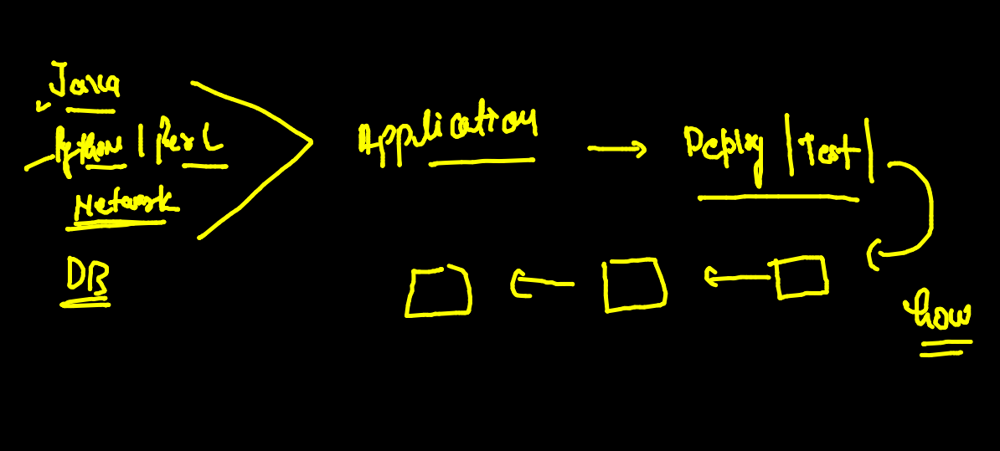
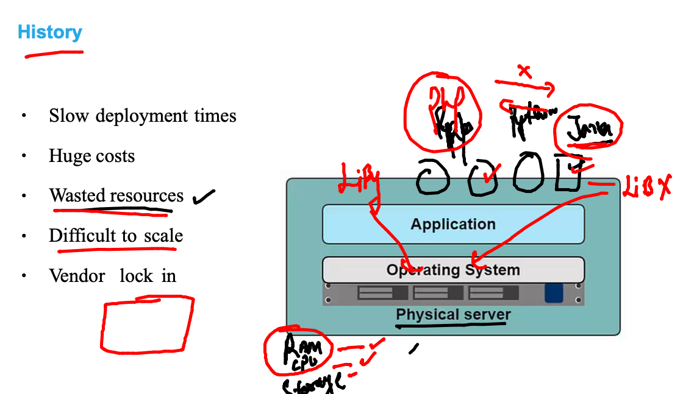
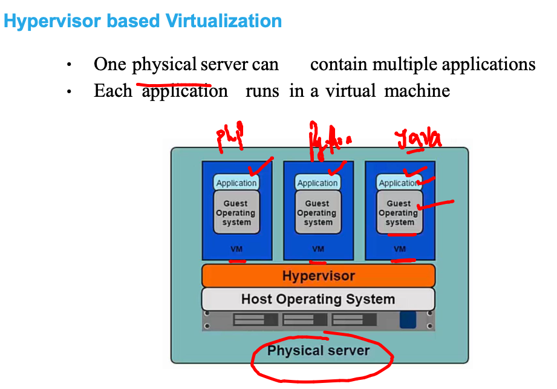
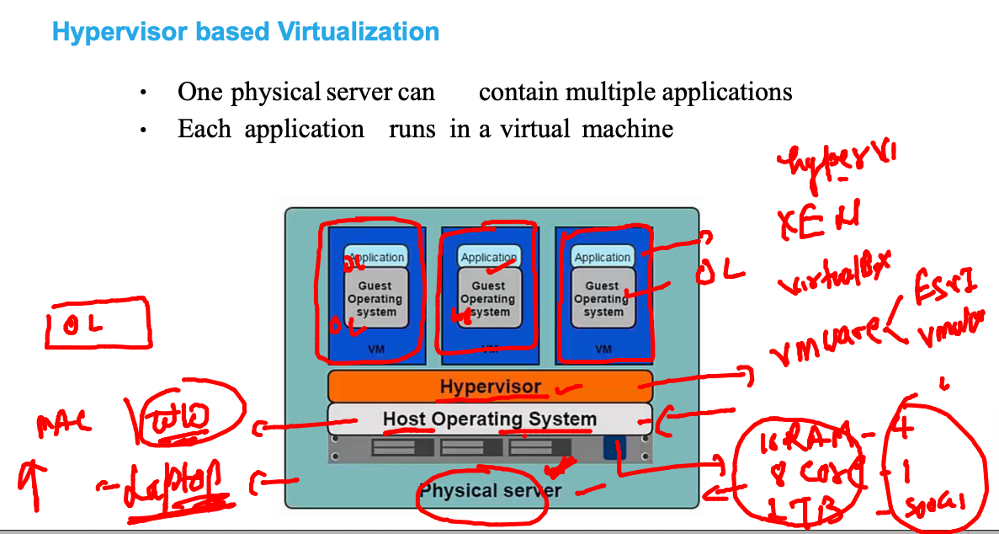
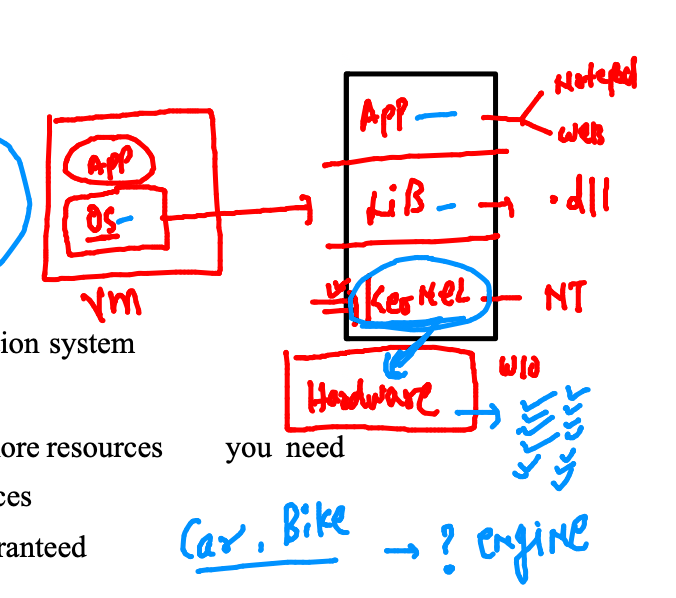
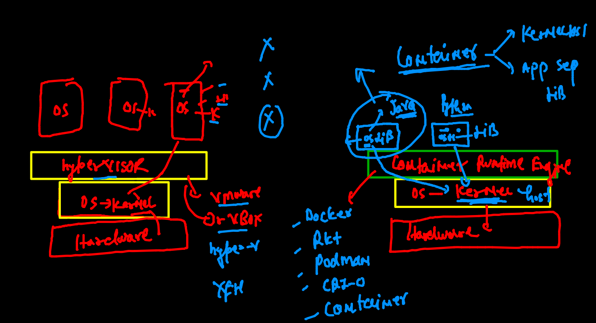
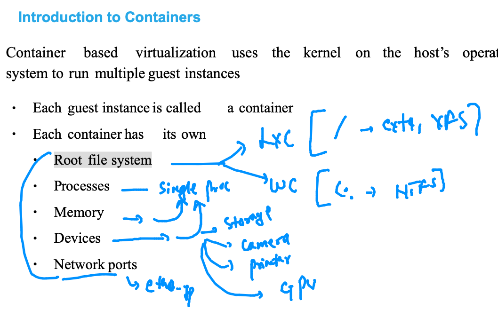
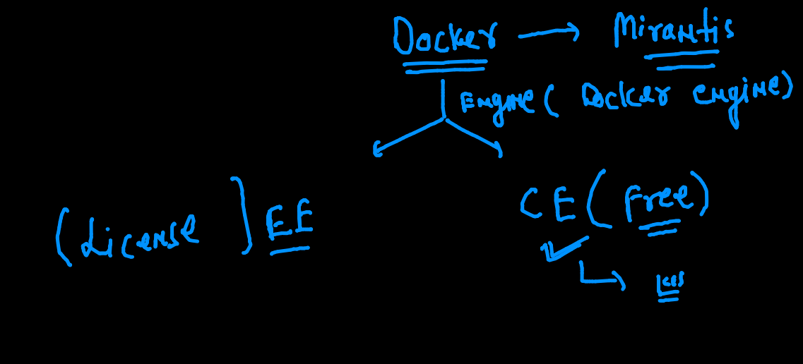
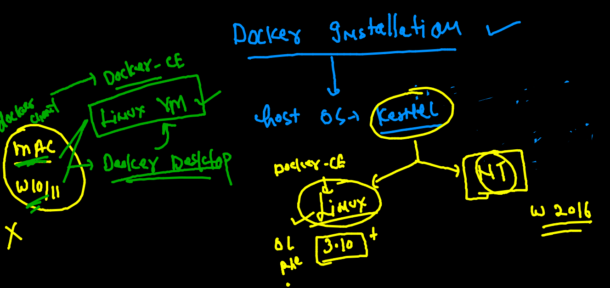
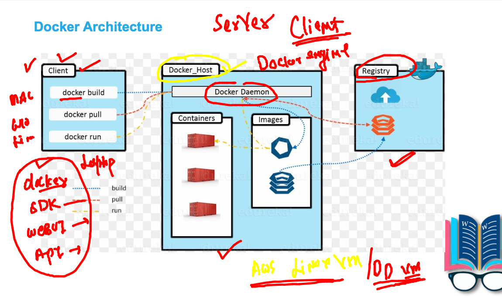

# Plan 


## application for this training 



### app testing or deployment in bare-metal



### Introduction to virtualization 



### hypervisor more info



## understanding OS component 



### VM vs COntainer 



### Containers 



### Intro to Docker 



### Understanding docker ce installation on windows 10 / mac os



### Mac os Docker desktop download link

[download](https://hub.docker.com/editions/community/docker-ce-desktop-mac)

### checking docker version 

```
fire@ashutoshhs-MacBook-Air  ~  docker  -v
Docker version 20.10.7, build f0df350

```

## Install docker in linux vm directly -- 

###  In stage / prod env for docker ce 

[link](https://docs.docker.com/engine/install/)

### installing 

```
[ec2-user@ip-172-31-18-96 ~]$ history 
    1  docker  -v
    2  sudo  yum install docker -y
    3  history 
[ec2-user@ip-172-31-18-96 ~]$ sudo systemctl start docker
[ec2-user@ip-172-31-18-96 ~]$ sudo systemctl enable docker
Created symlink from /etc/systemd/system/multi-user.target.wants/docker.service to /u
sr/lib/systemd/system/docker.service.

```
### Docker architecture in short way



### to check docker engine 

```
[ashu@ip-172-31-18-96 ~]$ docker version 
Client:
 Version:           20.10.7
 API version:       1.41
 Go version:        go1.15.14
 Git commit:        f0df350
 Built:             Tue Aug 17 16:01:45 2021
 OS/Arch:           linux/amd64
 Context:           default
 Experimental:      true

Server:
 Engine:
  Version:          20.10.7
  API version:      1.41 (minimum version 1.12)
  Go version:       go1.15.14
  Git commit:       b0f5bc3
  Built:            Tue Aug 17 16:02:23 2021
  OS/Arch:          linux/amd64
  Experimental:     false
 containerd:
  Version:          1.4.6
  GitCommit:        d71fcd7d8303cbf684402823e425e9dd2e99285d
 runc:
  Version:          1.0.0
  GitCommit:        %runc_commit
 docker-init:
  Version:          0.19.0
  GitCommit:        de40ad0
  
  
```


