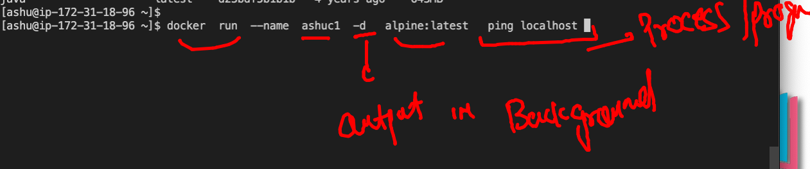

# Plan 


## application for this training 


### app testing or deployment in bare-metal


### Introduction to virtualization 


### hypervisor more info


## understanding OS component 


### VM vs COntainer 


### Containers 


### Intro to Docker 


### Understanding docker ce installation on windows 10 / mac os


### Mac os Docker desktop download link

[download](https://hub.docker.com/editions/community/docker-ce-desktop-mac)

### checking docker version 

```
fire@ashutoshhs-MacBook-Air  ~  docker  -v
Docker version 20.10.7, build f0df350

```

## Install docker in linux vm directly -- 

###  In stage / prod env for docker ce 

[link](https://docs.docker.com/engine/install/)

### installing 

```
[ec2-user@ip-172-31-18-96 ~]$ history 
    1  docker  -v
    2  sudo  yum install docker -y
    3  history 
[ec2-user@ip-172-31-18-96 ~]$ sudo systemctl start docker
[ec2-user@ip-172-31-18-96 ~]$ sudo systemctl enable docker
Created symlink from /etc/systemd/system/multi-user.target.wants/docker.service to /u
sr/lib/systemd/system/docker.service.

```
### Docker architecture in short way


### to check docker engine 

```
[ashu@ip-172-31-18-96 ~]$ docker version 
Client:
 Version:           20.10.7
 API version:       1.41
 Go version:        go1.15.14
 Git commit:        f0df350
 Built:             Tue Aug 17 16:01:45 2021
 OS/Arch:           linux/amd64
 Context:           default
 Experimental:      true

Server:
 Engine:
  Version:          20.10.7
  API version:      1.41 (minimum version 1.12)
  Go version:       go1.15.14
  Git commit:       b0f5bc3
  Built:            Tue Aug 17 16:02:23 2021
  OS/Arch:          linux/amd64
  Experimental:     false
 containerd:
  Version:          1.4.6
  GitCommit:        d71fcd7d8303cbf684402823e425e9dd2e99285d
 runc:
  Version:          1.0.0
  GitCommit:        %runc_commit
 docker-init:
  Version:          0.19.0
  GitCommit:        de40ad0
  
  
```

### pulling image of python from docker hub 

```
[ashu@ip-172-31-18-96 ~]$ docker  pull  python
Using default tag: latest
latest: Pulling from library/python
df5590a8898b: Pull complete 
705bb4cb554e: Pull complete 
519df5fceacd: Pull complete 
ccc287cbeddc: Pull complete 
e3f8e6af58ed: Pull complete 
aebed27b2d86: Pull complete 
cbad01103bfe: Pull complete 
70d3792d870b: Pull complete 
98d95f720735: Pull complete 
Digest: sha256:b35af9960cf515d9ad0070a0c7981addd000298f0d39e82ea287f7060480c219
Status: Downloaded newer image for python:latest
docker.io/library/python:latest

```

### docker images present 

```
[ashu@ip-172-31-18-96 ~]$ docker  images
REPOSITORY    TAG       IMAGE ID       CREATED       SIZE
openjdk       latest    98edbd09d5e6   4 days ago    471MB
oraclelinux   8.4       0e8cb31f3519   4 days ago    246MB
python        latest    6beb0d435def   5 days ago    911MB
alpine        latest    14119a10abf4   5 weeks ago   5.6MB
java          latest    d23bdf5b1b1b   4 years ago   643MB

```

### Container creation 



### list of running containers only 

```
[ashu@ip-172-31-18-96 ~]$ docker  ps
CONTAINER ID   IMAGE           COMMAND            CREATED          STATUS          PORTS     NAMES
ed7ff936446e   alpine:latest   "ping localhost"   3 seconds ago    Up 2 seconds              sid123
7542a8d85ce0   alpine:latest   "ping localhost"   35 seconds ago   Up 34 seconds             rupa1
4a471d2277b8   alpine:latest   "ping localhost"   42 seconds ago   Up 41 seconds             ashuc1

```

### checking output of a running container 

```
  26  docker  logs  ashuc1 
   27  docker  logs  -f  ashuc1 
   
```

### stopping a container 

```
[ashu@ip-172-31-18-96 ~]$ docker  stop  ashuc1

```

### start container the same one 

```
[ashu@ip-172-31-18-96 ~]$ docker  start  ashuc1
ashuc1
[ashu@ip-172-31-18-96 ~]$ docker  ps
CONTAINER ID   IMAGE           COMMAND            CREATED         STATUS         PORTS     NAMES
c42625077265   alpine:latest   "ping localhost"   2 minutes ago   Up 2 minutes             shinic1
4a471d2277b8   alpine:latest   "ping localhost"   7 minutes ago   Up 1 second              ashuc1

```

### getting a shell of a container 

```
[ashu@ip-172-31-18-96 ~]$ docker  exec  -it  ashuc1  sh 
/ # 
/ # cat /etc/os-release 
NAME="Alpine Linux"
ID=alpine
VERSION_ID=3.14.2
PRETTY_NAME="Alpine Linux v3.14"
HOME_URL="https://alpinelinux.org/"
BUG_REPORT_URL="https://bugs.alpinelinux.org/"
/ # ls  /
bin    etc    lib    mnt    proc   run    srv    tmp    var
dev    home   media  opt    root   sbin   sys    usr
/ # exit

```


