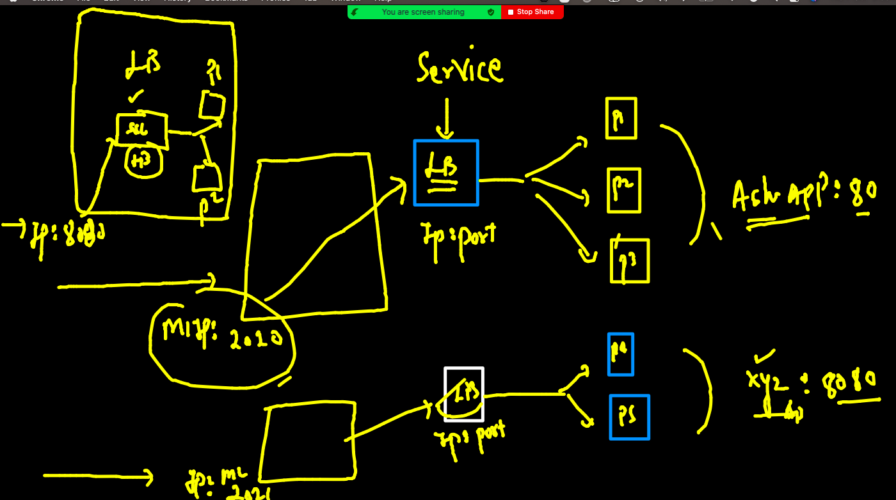
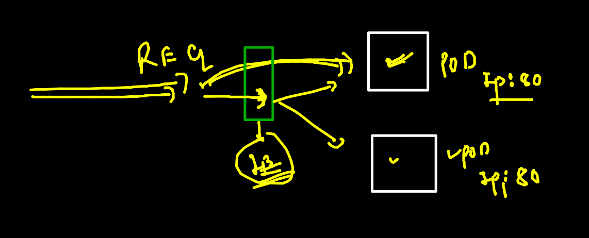
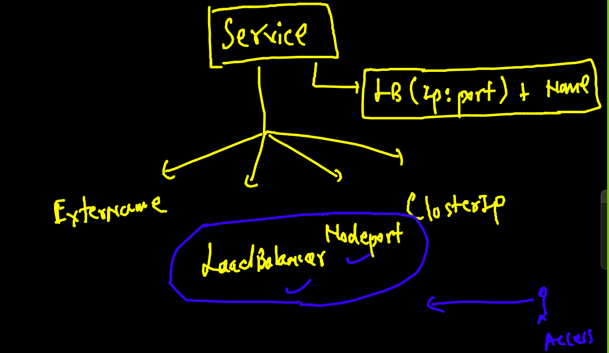
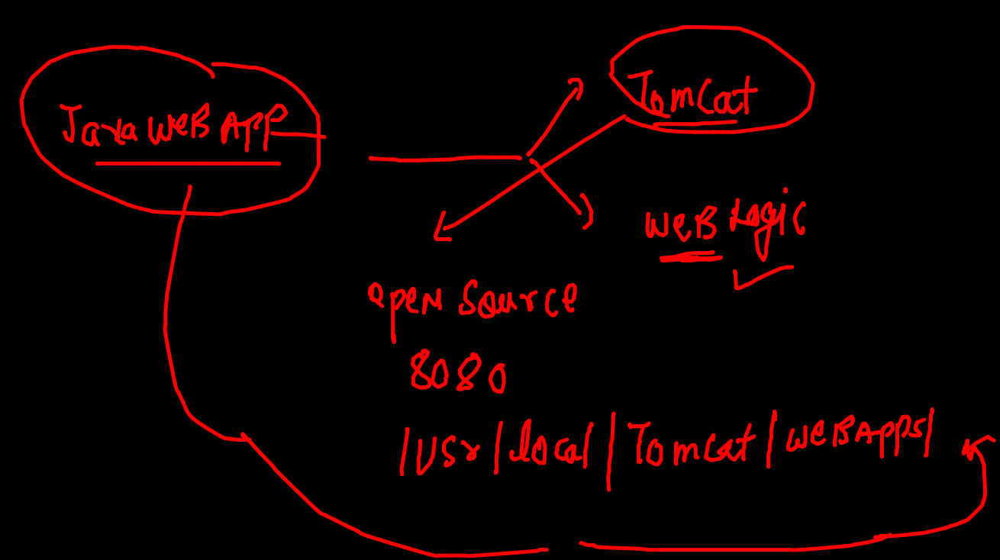

# Plan 


## docker & Kubernetes revision 


## checking k8s master / control plane connection from local client machine 

```
fire@ashutoshhs-MacBook-Air  ~/Desktop  kubectl  get  nodes  --kubeconfig  admin.conf 
NAME            STATUS   ROLES                  AGE   VERSION
control-plane   Ready    control-plane,master   25h   v1.22.2
minion-node1    Ready    <none>                 25h   v1.22.2
minion-node2    Ready    <none>                 25h   v1.22.2

```

### setting up config file 


### sending req to kube-apiserver 

```
kubectl  cluster-info 
Kubernetes control plane is running at https://3.230.187.160:6443
CoreDNS is running at https://3.230.187.160:6443/api/v1/namespaces/kube-system/services/kube-dns:dns/proxy

To further debug and diagnose cluster problems, use 'kubectl cluster-info dump'

```

### kube-schedular


### kube schedular algo 


### kube-controller-manager


### ETCD 


### kubernetes minion side 


### Minion will also have CNI installed to create Bridge and assign IP to containers


## Intro to POD Design 


### testing yaml syntax only  (do not create POD)

```
kubectl  apply  -f  ashupod1.yaml  --dry-run=client 
pod/ashupod1 created (dry run)

```

### deployment of pod 

```
fire@ashutoshhs-MacBook-Air  ~/Desktop/k8s_appdeploy  kubectl  apply  -f  ashupod1.yaml                   
pod/ashupod1 created
 fire@ashutoshhs-MacBook-Air  ~/Desktop/k8s_appdeploy  kubectl   get  pods
NAME        READY   STATUS              RESTARTS   AGE
ashupod1    1/1     Running             0          10s
lohitpod1   0/1     ContainerCreating   0          2s

```

### checking ip and scheduled Node name of any POd 

```
kubectl   get  po  ashupod1  -o wide
NAME       READY   STATUS    RESTARTS   AGE     IP              NODE           NOMINATED NODE   READINESS GATES
ashupod1   1/1     Running   0          7m39s   192.168.100.1   minion-node2   <none>           <none>

```

### checking same details as above for all the pods 

```
fire@ashutoshhs-MacBook-Air  ~/Desktop/k8s_appdeploy  kubectl   get  po   -o wide
NAME           READY   STATUS    RESTARTS   AGE     IP              NODE           NOMINATED NODE   READINESS GATES
archanapod1    1/1     Running   0          7m1s    192.168.100.6   minion-node2   <none>           <none>
ashupod1       1/1     Running   0          9m5s    192.168.100.1   minion-node2   <none>           <none>
chandrapod1    1/1     Running   0          3m26s   192.168.3.77    minion-node1   <none>           <none>
lohitpod1      1/1     Running   0          8m57s   192.168.100.2   minion-node2   <none>           <none>

```

### checking more detail of POD 

```
fire@ashutoshhs-MacBook-Air  ~/Desktop/k8s_appdeploy  kubectl  describe  pod ashupod1 
Name:         ashupod1
Namespace:    default
Priority:     0
Node:         minion-node2/172.31.24.67
Start Time:   Thu, 07 Oct 2021 11:48:17 +0530
Labels:       <none>
Annotations:  cni.projectcalico.org/containerID: 55f4f9e2ac13d981056653903e16817ed8e7840596f4a9a13942a052122a05b1
              cni.projectcalico.org/podIP: 192.168.100.1/32
              cni.projectcalico.org/podIPs: 192.168.100.1/32
Status:       Running
IP:           192.168.100.1
IPs:
  IP:  192.168.100.1
Containers:
  ashuc1:
    Container ID:  docker://3f05da42a2e7dd81c0e3aa7ca4de0a8fdb6bcd9943a9a55ab479692b92124c6d
    Image:         alpine
    Image ID:      docker-pullable://alpine@sha256:e1c082e3d3c45cccac829840a25941e679c25d438cc8412c2fa221cf1a824e6a
    Port:          <none>
    Host Port:     <none>
    Command:
      sh
      -c
      ping fb.com
    State:          Running
    
```

### checking output of container running inside POD 

```
 kubectl  logs  -f  ashupod1 
 
```

### manual scheduling of POD 


### access container inside pod 

```
kubectl  exec  -it  ashupod1  -- sh 
/ # 
/ # 
/ # 
/ # cat  /etc/os-release 
NAME="Alpine Linux"
ID=alpine
VERSION_ID=3.14.2
PRETTY_NAME="Alpine Linux v3.14"
HOME_URL="https://alpinelinux.org/"
BUG_REPORT_URL="https://bugs.alpinelinux.org/"
/ # exit

```
## POD command history 

```
 5194  kubectl  apply  -f  ashupod1.yaml  --dry-run=client 
 5195  kubectl  apply  -f  ashupod1.yaml  
 5196  kubectl   get  pods

 5204  kubectl   get  po  ashupod1  -o wide
 5205  kubectl   get  po   -o wide
 5206  kubectl  describe  pod ashupod1 
 5212  kubectl  logs  -f  ashupod1  
 5213  history
 5214  kubectl  delete pod  ashupod1
 5215  kubectl  get  no
 5216  kubectl  apply -f  ashupod1.yaml
 5217  kubectl   get  po  ashupod1  -o wide
 5218  kubectl  logs  -f  ashupod1  
 5219  history
 5220  kubectl  exec  -it  ashupod1  -- sh 
 
 ```
 
 ### deleting all the pods 
 
 ```
 fire@ashutoshhs-MacBook-Air  ~/Desktop/k8s_appdeploy  kubectl  delete pods  --all
pod "archanapod1" deleted
pod "ashupod1" deleted
pod "chandrapod1" deleted
pod "lohitpod1" deleted
pod "mahepod1" deleted
pod "mohitpod1" deleted
pod "prashpod1" deleted
pod "rajipod1" deleted
pod "rchamantpod1" deleted
pod "rupapod1" deleted
pod "shinipod1" deleted
pod "sidpod1" deleted
pod "yagpod1" deleted


```

### AUTO generate YAML / JSON file for POD 


```

 kubectl  run  ashupod2  --image=alpine --command ping fb.com    --dry-run=client  -o  yaml 
apiVersion: v1
kind: Pod
metadata:
  creationTimestamp: null
  labels:
    run: ashupod2
  name: ashupod2
spec:
  containers:
  - command:
    - ping
    - fb.com
    image: alpine
    name: ashupod2
    resources: {}
  dnsPolicy: ClusterFirst
  restartPolicy: Always
status: {}


 fire@ashutoshhs-MacBook-Air  ~/Desktop/k8s_appdeploy  kubectl  run  ashupod2  --image=alpine --command ping fb.com    --dry-run=client  -o  yaml  >auto.yaml 
 
 ```
 
 ### summary of autogen 
 
 ```
 5240  kubectl  run  ashupod2  --image=alpine --command ping fb.com    --dry-run=client  -o  yaml 
 5241  kubectl  run  ashupod2  --image=alpine --command ping fb.com    --dry-run=client  -o  yaml  >auto.yaml 
 5242  kubectl  run  ashupod2  --image=alpine --command ping fb.com    --dry-run=client  -o  json 
 5243  kubectl  run  ashupod2  --image=alpine --command ping fb.com    --dry-run=client  -o  json >auotpod.json 
 
 ```
 
 ###
 
 ```
 ashupod1.yaml auotpod.json  auto.yaml     logs.txt      task1.yaml
 fire@ashutoshhs-MacBook-Air  ~/Desktop/k8s_appdeploy  kubectl  apply -f  auotpod.json 
pod/ashupod2 created
 fire@ashutoshhs-MacBook-Air  ~/Desktop/k8s_appdeploy  kubectl  get  po 
NAME        READY   STATUS    RESTARTS   AGE
ashupod2    1/1     Running   0          7s

```

### creating web app pod 

```
fire@ashutoshhs-MacBook-Air  ~/Desktop/k8s_appdeploy  kubectl  run  ashuwebpod1  --image=dockerashu/nginx:5thoct2021  --port  80 --dry-run=client     -o yaml 
apiVersion: v1
kind: Pod
metadata:
  creationTimestamp: null
  labels:
    run: ashuwebpod1
  name: ashuwebpod1
spec:
  containers:
  - image: dockerashu/nginx:5thoct2021
    name: ashuwebpod1
    ports:
    - containerPort: 80
    resources: {}
  dnsPolicy: ClusterFirst
  restartPolicy: Always
status: {}
 fire@ashutoshhs-MacBook-Air  ~/Desktop/k8s_appdeploy  kubectl  run  ashuwebpod1  --image=dockerashu/nginx:5thoct2021  --port  80 --dry-run=client     -o yaml   >ashunginx.yaml
 
 ```
 
 ### accessing application using kubectl client 
 
 ```
 ✘ fire@ashutoshhs-MacBook-Air  ~/Desktop/k8s_appdeploy  kubectl  port-forward  ashuwebpod1  1122:80
Forwarding from 127.0.0.1:1122 -> 80
Forwarding from [::1]:1122 -> 80
Handling connection for 1122
Handling connection for 1122
Handling connection for 1122
Handling connection for 1122
Handling connection for 1122
Handling connection for 1122

```

### Intro to Internal load balancer in k8s minion side



###  LB understanding 



### service / LB will be using label of pods to find pod and send traffic 


### to access app from outside we are using Node port and Loadbalancer service 




### Nodeport service 


### checking label of pods 

```
fire@ashutoshhs-MacBook-Air  ~/Desktop/k8s_appdeploy  kubectl  get  po ashuwebpod1  --show-labels
NAME          READY   STATUS    RESTARTS   AGE    LABELS
ashuwebpod1   1/1     Running   0          131m   run=ashuwebpod1

```

#### creating nodeport serfice 

```
 ✘ fire@ashutoshhs-MacBook-Air  ~/Desktop/k8s_appdeploy  kubectl  create   service  nodeport  ashusvc1  --tcp 5544:80  --dry-run=client -o yaml 
apiVersion: v1
kind: Service
metadata:
  creationTimestamp: null
  labels:
    app: ashusvc1
  name: ashusvc1
spec:
  ports:
  - name: 5544-80
    port: 5544
    protocol: TCP
    targetPort: 80
  selector:
    app: ashusvc1
  type: NodePort
status:
  loadBalancer: {}
 fire@ashutoshhs-MacBook-Air  ~/Desktop/k8s_appdeploy  kubectl  create   service  nodeport  ashusvc1  --tcp 5544:80  --dry-run=client -o yaml  >websvc.yaml
 
 ```
 
 ### check thi 
 
 
 ```
 fire@ashutoshhs-MacBook-Air  ~/Desktop/k8s_appdeploy  kubectl  apply -f  websvc.yaml 
service/ashusvc1 created
 fire@ashutoshhs-MacBook-Air  ~/Desktop/k8s_appdeploy  
 fire@ashutoshhs-MacBook-Air  ~/Desktop/k8s_appdeploy  
 fire@ashutoshhs-MacBook-Air  ~/Desktop/k8s_appdeploy  kubectl  get  svc
NAME         TYPE        CLUSTER-IP       EXTERNAL-IP   PORT(S)          AGE
ashusvc1     NodePort    10.102.194.242   <none>        5544:32519/TCP   6s

```


### Deleting svc and pods

```
fire@ashutoshhs-MacBook-Air  ~  kubectl  delete all --all
pod "archanapod1" deleted
pod "ashuwebpod1" deleted
pod "chandrawebpod1" deleted
pod "lohitpod3" deleted
pod "mahewebpod1" deleted
pod "mohitpod1" deleted
pod "prashanthwebpod1" deleted
pod "pripod1" deleted
pod "rajiwebpod1" deleted
pod "rchamantpod1" deleted
pod "rchamantpod2" deleted
pod "rupapod2" deleted
pod "shinipod1" deleted
pod "shiniwebpod1" deleted
pod "sidwebpod1" deleted
pod "yagwebpod1" deleted
service "archanasvc1" deleted
service "ashusvc1" deleted
service "chandrac1" deleted
service "chandrac2" deleted


```

###

```
fire@ashutoshhs-MacBook-Air  ~/Desktop/k8s_appdeploy  kubectl  apply -f  ashufinalapp.yaml 
pod/ashuwebpod1 created
service/ashusvc1 created
 fire@ashutoshhs-MacBook-Air  ~/Desktop/k8s_appdeploy  kubectl  get  po
NAME          READY   STATUS    RESTARTS   AGE
archanapod1   1/1     Running   0          44s
ashuwebpod1   1/1     Running   0          6s
mahewebpod1   1/1     Running   0          22s
 fire@ashutoshhs-MacBook-Air  ~/Desktop/k8s_appdeploy  kubectl  get  svc
NAME          TYPE        CLUSTER-IP      EXTERNAL-IP   PORT(S)          AGE
archanapod1   NodePort    10.101.180.24   <none>        5544:32117/TCP   48s
ashusvc1      NodePort    10.104.98.57    <none>        5544:30728/TCP   9s
kubernetes    ClusterIP   10.96.0.1       <none>        443/TCP          6m19s
mahesvc1      NodePort    10.99.135.66    <none>        5544:32006/TCP   26s
 fire@ashutoshhs-MacBook-Air  ~/Desk
 
 ```
 
 
 ### java web with tomcat application 
 
 
 
 ### BUilding docker images
 
 ```
 docker  build  -t  dockerashu/tomcat:oracleappv1  https://github.com/redashu/javawebapp.git
Sending build context to Docker daemon  154.6kB
Step 1/6 : FROM tomcat
latest: Pulling from library/tomcat
df5590a8898b: Already exists 
705bb4cb554e: Already exists 
519df5fceacd: Already exists 
ccc287cbeddc: Already exists 
39a2961e8351: Pull complete 
0287b7aa7f62: Pull complete 
165d4a436d89: Pull complete 
2b9d00974b45: Pull complete 
8ec846c322cf: Pull complete 
1000c7fbcebb: Pull complete 
Digest: sha256:f3901a8359495b00474bd253cc446971c0277fc394ba37a020f0b9d84080fced
Status: Downloaded newer image for tomcat:latest
 ---> 6313f84af805
Step 2/6 : WORKDIR /usr/local/tomcat/webapps
 ---> Running in f91cfcc3aa32
Removing intermediate container f91cfcc3aa32
 ---> 8571b4a62299
Step 3/6 : RUN mkdir oracle
 ---> Running in d9af6c630f39
Removing intermediate container d9af6c630f39
 ---> 77f3f22e6098
Step 4/6 : WORKDIR oracle
 ---> Running in fab01a35bb04
Removing intermediate container fab01a35bb04
 ---> 24bfe3c4c9e1
Step 5/6 : ADD myapp .
 ---> efa1654a8d8d
Step 6/6 : EXPOSE 8080
 ---> Running in 29b1ac03f4bc
Removing intermediate container 29b1ac03f4bc
 ---> 7f5ee9aa5914
Successfully built 7f5ee9aa5914
Successfully tagged dockerashu/tomcat:oracleappv1

```

### pushing to docker hub 

```
[root@ip-172-31-18-96 ~]# docker  login -u dockerashu
Password: 
WARNING! Your password will be stored unencrypted in /root/.docker/config.json.
Configure a credential helper to remove this warning. See
https://docs.docker.com/engine/reference/commandline/login/#credentials-store

Login Succeeded
[root@ip-172-31-18-96 ~]# docker push dockerashu/tomcat:oracleappv1
The push refers to repository [docker.io/dockerashu/tomcat]
5d731f37c175: Pushed 
cb22288aff9f: Pushed 
b76a02ab2a70: Mounted from library/tomcat 
2dc1aa92b587: Mounted from library/tomcat 
73819629b437: Layer already exists 
874ad65f91ea: Layer already exists 
0fc2498b65e5: Layer already exists 
d08e6b97bf21: Layer already exists 
3054497613e6: Layer already exists 
d35dc7f4c79e: Layer already exists 
dabfe5b2ea81: Layer already exists 
5e6a409f30b6: Layer already exists 
oracleappv1: digest: sha256:df8c099c55a03705473ec6d0ed30852f925ed346fe80504989987c1f84c50292 size: 2838
[root@ip-172-31-18-96 ~]# docker logout 
Removing login credentials for https://index.docker.io/v1/

```

### deploy in k8s as pod 

```
kubectl  run  ashujavaapp --image=dockerashu/tomcat:oracleappv1  --port  8080  --dry-run=client -o yaml

kubectl  create service nodeport ashujvsvc1 --tcp 1245:8080 --dry-run=client -o yaml 
apiVersion: v1
kind: Service
metadata:
  creationTimestamp: null
  labels:
    app: ashujvsvc1
  name: ashujvsvc1
spec:
  ports:
  - name: 1245-8080
    port: 1245
    protocol: TCP
    targetPort: 8080
  selector:
    app: ashujvsvc1
  type: NodePort
status:
  loadBalancer: {}
  
  
```
  
 ## app deployment and access in k8s using pod and nodeport service
 
 
 
 ### k8s cluster setup 
 
 
 
 ### starting minikube cluster 
 
 ```
 minikube  start                  
😄  minikube v1.22.0 on Darwin 11.4
✨  Automatically selected the hyperkit driver
🎉  minikube 1.23.2 is available! Download it: https://github.com/kubernetes/minikube/releases/tag/v1.23.2
💡  To disable this notice, run: 'minikube config set WantUpdateNotification false'

💿  Downloading VM boot image ...
    > minikube-v1.22.0.iso.sha256: 65 B / 65 B [-------------] 100.00% ? p/s 0s
    > minikube-v1.22.0.iso: 38.87 MiB / 242.95 MiB  16.00% 3.41 MiB p/s ETA 59s
    
  ```
  
  


