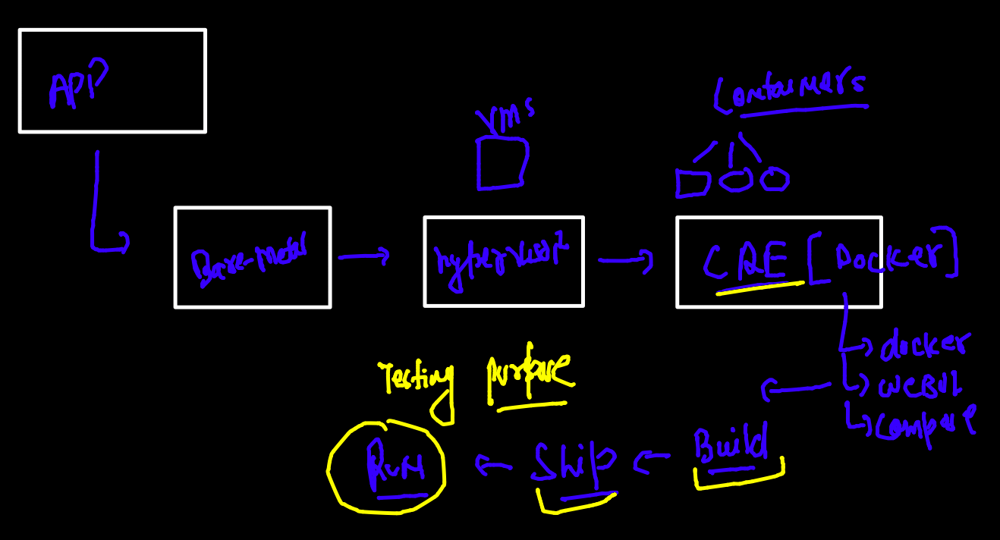
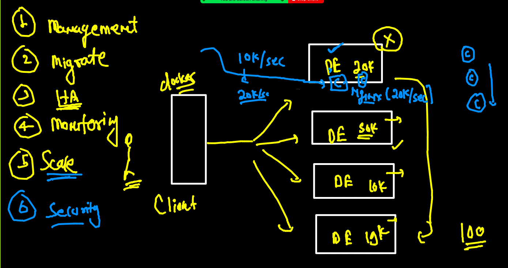
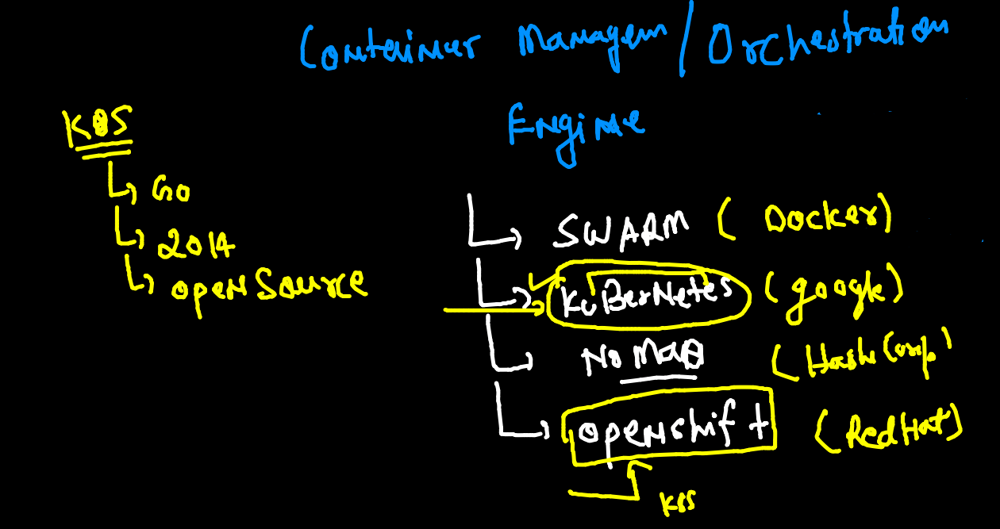
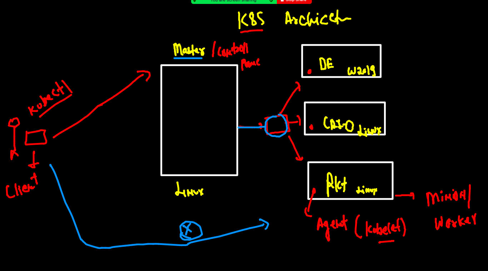

# Plan 


## Journey till docker 




### Problem with Docker engine and its client tools 



### COntainer orchestration engines 



## lets understanding kubernetes architecture 



### Installing kubectl using minikube 

[Downloadlink](https://minikube.sigs.k8s.io/docs/start/)


### kube-api server 


### auth file on k8s cluster side 

```
root@control-plane ~]# cd  /etc/kubernetes/
[root@control-plane kubernetes]# ls
admin.conf 

```


### checking connection to master node

```
fire@ashutoshhs-MacBook-Air  ~/Desktop  kubectl   get  nodes  --kubeconfig  admin.conf 
NAME            STATUS   ROLES                  AGE   VERSION
control-plane   Ready    control-plane,master   8h    v1.22.2
minion-node1    Ready    <none>                 8h    v1.22.2
minion-node2    Ready    <none>                 8h    v1.22.2

```

