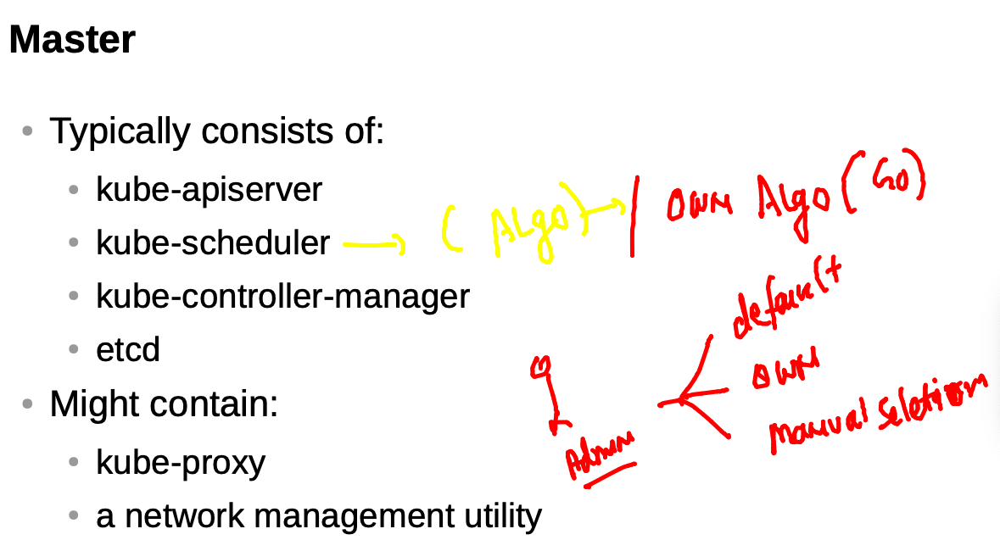

# Plan 


## docker & Kubernetes revision 


## checking k8s master / control plane connection from local client machine 

```
fire@ashutoshhs-MacBook-Air  ~/Desktop  kubectl  get  nodes  --kubeconfig  admin.conf 
NAME            STATUS   ROLES                  AGE   VERSION
control-plane   Ready    control-plane,master   25h   v1.22.2
minion-node1    Ready    <none>                 25h   v1.22.2
minion-node2    Ready    <none>                 25h   v1.22.2

```

### setting up config file 


### sending req to kube-apiserver 

```
kubectl  cluster-info 
Kubernetes control plane is running at https://3.230.187.160:6443
CoreDNS is running at https://3.230.187.160:6443/api/v1/namespaces/kube-system/services/kube-dns:dns/proxy

To further debug and diagnose cluster problems, use 'kubectl cluster-info dump'

```

### kube-schedular


### kube schedular algo 



### kube-controller-manager


### ETCD 


### kubernetes minion side 


### Minion will also have CNI installed to create Bridge and assign IP to containers


