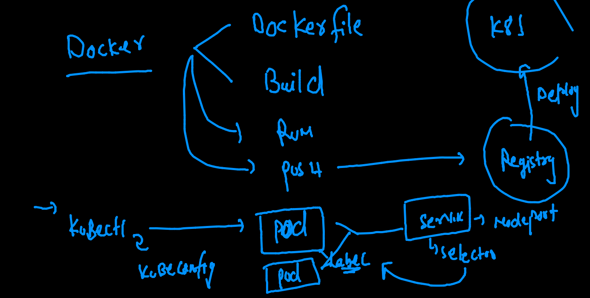
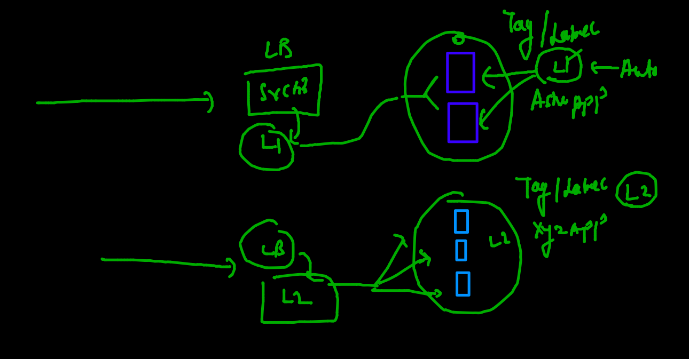

# Plan 


## docker & Kubernetes revision 



## checking k8s master / control plane connection from local client machine 

```
fire@ashutoshhs-MacBook-Air  ~/Desktop  kubectl  get  nodes  --kubeconfig  admin.conf 
NAME            STATUS   ROLES                  AGE   VERSION
control-plane   Ready    control-plane,master   25h   v1.22.2
minion-node1    Ready    <none>                 25h   v1.22.2
minion-node2    Ready    <none>                 25h   v1.22.2

```

### setting up config file 


### sending req to kube-apiserver 

```
kubectl  cluster-info 
Kubernetes control plane is running at https://3.230.187.160:6443
CoreDNS is running at https://3.230.187.160:6443/api/v1/namespaces/kube-system/services/kube-dns:dns/proxy

To further debug and diagnose cluster problems, use 'kubectl cluster-info dump'

```

### kube-schedular


### kube schedular algo 


### kube-controller-manager


### ETCD 


### kubernetes minion side 


### Minion will also have CNI installed to create Bridge and assign IP to containers


## Intro to POD Design 


### testing yaml syntax only  (do not create POD)

```
kubectl  apply  -f  ashupod1.yaml  --dry-run=client 
pod/ashupod1 created (dry run)

```

### deployment of pod 

```
fire@ashutoshhs-MacBook-Air  ~/Desktop/k8s_appdeploy  kubectl  apply  -f  ashupod1.yaml                   
pod/ashupod1 created
 fire@ashutoshhs-MacBook-Air  ~/Desktop/k8s_appdeploy  kubectl   get  pods
NAME        READY   STATUS              RESTARTS   AGE
ashupod1    1/1     Running             0          10s
lohitpod1   0/1     ContainerCreating   0          2s

```

### checking ip and scheduled Node name of any POd 

```
kubectl   get  po  ashupod1  -o wide
NAME       READY   STATUS    RESTARTS   AGE     IP              NODE           NOMINATED NODE   READINESS GATES
ashupod1   1/1     Running   0          7m39s   192.168.100.1   minion-node2   <none>           <none>

```

### checking same details as above for all the pods 

```
fire@ashutoshhs-MacBook-Air  ~/Desktop/k8s_appdeploy  kubectl   get  po   -o wide
NAME           READY   STATUS    RESTARTS   AGE     IP              NODE           NOMINATED NODE   READINESS GATES
archanapod1    1/1     Running   0          7m1s    192.168.100.6   minion-node2   <none>           <none>
ashupod1       1/1     Running   0          9m5s    192.168.100.1   minion-node2   <none>           <none>
chandrapod1    1/1     Running   0          3m26s   192.168.3.77    minion-node1   <none>           <none>
lohitpod1      1/1     Running   0          8m57s   192.168.100.2   minion-node2   <none>           <none>

```

### checking more detail of POD 

```
fire@ashutoshhs-MacBook-Air  ~/Desktop/k8s_appdeploy  kubectl  describe  pod ashupod1 
Name:         ashupod1
Namespace:    default
Priority:     0
Node:         minion-node2/172.31.24.67
Start Time:   Thu, 07 Oct 2021 11:48:17 +0530
Labels:       <none>
Annotations:  cni.projectcalico.org/containerID: 55f4f9e2ac13d981056653903e16817ed8e7840596f4a9a13942a052122a05b1
              cni.projectcalico.org/podIP: 192.168.100.1/32
              cni.projectcalico.org/podIPs: 192.168.100.1/32
Status:       Running
IP:           192.168.100.1
IPs:
  IP:  192.168.100.1
Containers:
  ashuc1:
    Container ID:  docker://3f05da42a2e7dd81c0e3aa7ca4de0a8fdb6bcd9943a9a55ab479692b92124c6d
    Image:         alpine
    Image ID:      docker-pullable://alpine@sha256:e1c082e3d3c45cccac829840a25941e679c25d438cc8412c2fa221cf1a824e6a
    Port:          <none>
    Host Port:     <none>
    Command:
      sh
      -c
      ping fb.com
    State:          Running
    
```

### checking output of container running inside POD 

```
 kubectl  logs  -f  ashupod1 
 
```

### manual scheduling of POD 


### access container inside pod 

```
kubectl  exec  -it  ashupod1  -- sh 
/ # 
/ # 
/ # 
/ # cat  /etc/os-release 
NAME="Alpine Linux"
ID=alpine
VERSION_ID=3.14.2
PRETTY_NAME="Alpine Linux v3.14"
HOME_URL="https://alpinelinux.org/"
BUG_REPORT_URL="https://bugs.alpinelinux.org/"
/ # exit

```
## POD command history 

```
 5194  kubectl  apply  -f  ashupod1.yaml  --dry-run=client 
 5195  kubectl  apply  -f  ashupod1.yaml  
 5196  kubectl   get  pods

 5204  kubectl   get  po  ashupod1  -o wide
 5205  kubectl   get  po   -o wide
 5206  kubectl  describe  pod ashupod1 
 5212  kubectl  logs  -f  ashupod1  
 5213  history
 5214  kubectl  delete pod  ashupod1
 5215  kubectl  get  no
 5216  kubectl  apply -f  ashupod1.yaml
 5217  kubectl   get  po  ashupod1  -o wide
 5218  kubectl  logs  -f  ashupod1  
 5219  history
 5220  kubectl  exec  -it  ashupod1  -- sh 
 
 ```
 
 ### deleting all the pods 
 
 ```
 fire@ashutoshhs-MacBook-Air  ~/Desktop/k8s_appdeploy  kubectl  delete pods  --all
pod "archanapod1" deleted
pod "ashupod1" deleted
pod "chandrapod1" deleted
pod "lohitpod1" deleted
pod "mahepod1" deleted
pod "mohitpod1" deleted
pod "prashpod1" deleted
pod "rajipod1" deleted
pod "rchamantpod1" deleted
pod "rupapod1" deleted
pod "shinipod1" deleted
pod "sidpod1" deleted
pod "yagpod1" deleted


```

### AUTO generate YAML / JSON file for POD 


```

 kubectl  run  ashupod2  --image=alpine --command ping fb.com    --dry-run=client  -o  yaml 
apiVersion: v1
kind: Pod
metadata:
  creationTimestamp: null
  labels:
    run: ashupod2
  name: ashupod2
spec:
  containers:
  - command:
    - ping
    - fb.com
    image: alpine
    name: ashupod2
    resources: {}
  dnsPolicy: ClusterFirst
  restartPolicy: Always
status: {}


 fire@ashutoshhs-MacBook-Air  ~/Desktop/k8s_appdeploy  kubectl  run  ashupod2  --image=alpine --command ping fb.com    --dry-run=client  -o  yaml  >auto.yaml 
 
 ```
 
 ### summary of autogen 
 
 ```
 5240  kubectl  run  ashupod2  --image=alpine --command ping fb.com    --dry-run=client  -o  yaml 
 5241  kubectl  run  ashupod2  --image=alpine --command ping fb.com    --dry-run=client  -o  yaml  >auto.yaml 
 5242  kubectl  run  ashupod2  --image=alpine --command ping fb.com    --dry-run=client  -o  json 
 5243  kubectl  run  ashupod2  --image=alpine --command ping fb.com    --dry-run=client  -o  json >auotpod.json 
 
 ```
 
 ###
 
 ```
 ashupod1.yaml auotpod.json  auto.yaml     logs.txt      task1.yaml
 fire@ashutoshhs-MacBook-Air  ~/Desktop/k8s_appdeploy  kubectl  apply -f  auotpod.json 
pod/ashupod2 created
 fire@ashutoshhs-MacBook-Air  ~/Desktop/k8s_appdeploy  kubectl  get  po 
NAME        READY   STATUS    RESTARTS   AGE
ashupod2    1/1     Running   0          7s

```

### creating web app pod 

```
fire@ashutoshhs-MacBook-Air  ~/Desktop/k8s_appdeploy  kubectl  run  ashuwebpod1  --image=dockerashu/nginx:5thoct2021  --port  80 --dry-run=client     -o yaml 
apiVersion: v1
kind: Pod
metadata:
  creationTimestamp: null
  labels:
    run: ashuwebpod1
  name: ashuwebpod1
spec:
  containers:
  - image: dockerashu/nginx:5thoct2021
    name: ashuwebpod1
    ports:
    - containerPort: 80
    resources: {}
  dnsPolicy: ClusterFirst
  restartPolicy: Always
status: {}
 fire@ashutoshhs-MacBook-Air  ~/Desktop/k8s_appdeploy  kubectl  run  ashuwebpod1  --image=dockerashu/nginx:5thoct2021  --port  80 --dry-run=client     -o yaml   >ashunginx.yaml
 
 ```
 
 ### accessing application using kubectl client 
 
 ```
 ✘ fire@ashutoshhs-MacBook-Air  ~/Desktop/k8s_appdeploy  kubectl  port-forward  ashuwebpod1  1122:80
Forwarding from 127.0.0.1:1122 -> 80
Forwarding from [::1]:1122 -> 80
Handling connection for 1122
Handling connection for 1122
Handling connection for 1122
Handling connection for 1122
Handling connection for 1122
Handling connection for 1122

```

### Intro to Internal load balancer in k8s minion side


###  LB understanding 


### service / LB will be using label of pods to find pod and send traffic 




### to access app from outside we are using Node port and Loadbalancer service 


### Nodeport service 


```


